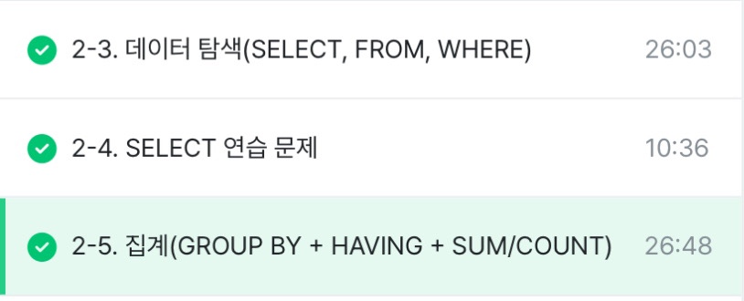

# 2-3. 데이터 탐색(SELECT, FROM, WHERE)
- SELECT: 테이블의 어떤 컬럼을 선택할 것인지
- FROM: 어떤 테이블에서 데이터를 확인할 것인지
- WHERE: 원하는 조건이 있다먼 어떤 조건인지

SELECT
 
col1 AS new_name,
 
col2
 
FROM dataset.table
 
WHERE
 
 condition

# 2-5. 집계(GROUP BY + HAVING + SUM/COUNT)
- 집계: 그룹화해서 계산
**GROUP BY**
- 특정 컬럼을 기준으로 모으면서 다른 컬럼에선 집계 가능

SELECT
 
col1,
 
function(COUNT, MAX, MIN etc.)
 
FROM dataset.table
 
GROUP BY
 
 col1
 
*집계할 컬럼을 select에 명시하고 그 컬럼을 꼭 group by에 작성*

**DISTINCT**
- 고유값을 알고 싶은 경우 = 중복 제외 

SELECT
 
col,
 
COUNT(DISTINCT count할 col)
 
FROM dataset.table
 
GROUP BY
 
 col

**그룹화 활용 경우**
- 일자별 집계, 연령대 별 집계, 특정 타입별 집계, 앱 화면별 집계

**WHERE VS HAVING**
- WHERE: table에 바로 조건 설정
- HAVING: group by한 후 조건 설정

SELECT
 
col, col2,
 
COUNT(col1) AS col1_count)
 
FROM table
 
GROUP BY col1, col2
 
HAVING
 
condition

**서브 쿼리** 
- select문 안에 존재하는 select 쿼리
- from절에 또 다른 select문 삽입 가능
- 괄호로 묶어서 사용

*서브 쿼리를 작성하고, 서브 쿼리 바깥에서 where 조건 설정하는 것 = 서브 쿼리에서 having으로 하는 것*

**정렬하기(ORDER BY)**
SELECT
 
col
 
FROM table
 
ORDER BY col order

- order: OSC(오름차순, 디폴트) / DESC(내림차순)
- ORDER BY는 쿼리의 맨 마지막에 작성

**출력 갯수 제한(LIMIT)**
- 쿼리문의 결과 row 수를 제한하고 싶은 경우 사용 

# summary
- 집계: group by + 집계함수(avg, max etc.)
- 고윳값: distinct
- 조건 설정: where / having
- 정렬: order by
- 출력 갯수 제한: limit

# 활동인증
 