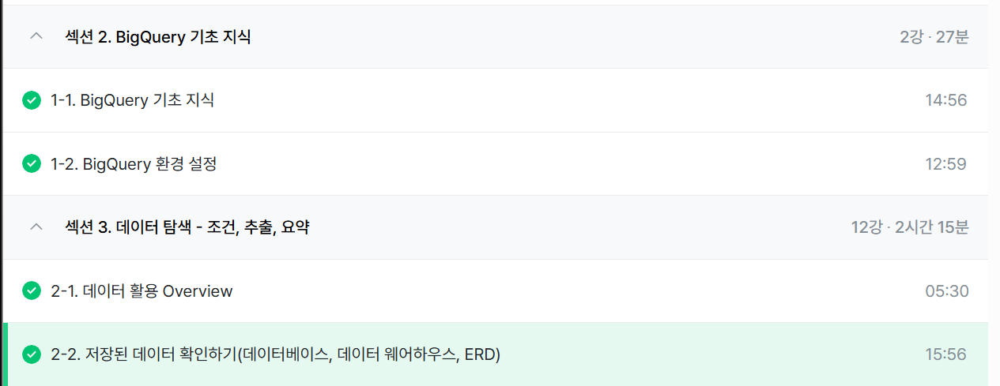

# 1-1. BigQuery 기초 지식 

**데이터 저장 형태**
- 데이터베이스(DB): 데이터의 저장소 ex) MySQL, Oracle 
- 테이블: 데이터가 저장된 공간

**데이터베이스의 특징**
- OLTP(Online Transaction Processing): 거래를 하기 위해 사용되는 데이터베이스, 보류&중간 상태 X 
- SQL: DB에서 데이터를 가지고 올 때 사용하는 언어

- 테이블 구조: row(행) 하나의 고유한 데이터  / column(열) 데이터의 속성 값
- OLAP(online analytical processing): 분석을 위한 기능 제공 / 데이터 웨어하우스(DW): 데이터를 한 곳에 모아서 저장

- BigQuery: 구글 클라우드 OLAP + 데이터 웨어하우스
  - 장점: 데이터 추출 쉬움, 빠른 속도, 서버 필요 X, 적은 비용 

# 1-2. BigQuery 환경 설정

**BigQuery 환경 구성 요소: 프로젝트 / 데이터셋 / 테이블** 
- 프로젝트: 하나의 큰 건물, 여러 데이터셋 존재
- 데이터셋: 프로젝트으 창고, 다양한 테이블 존재
- 테이블: 창고에 있는 선반, 행과 열로 이루어진 데이터 저장 

# 2-1. 데이터 활용 Overview

**데이터를 활용하는 과정**
- task -> 원하는 것 정하기 -> 데이터 탐색(단일/다량 자료): 조건, 추출 변환, 요약 -> 데이터 결과 검증 -> 피드백/활용

# 2-2. 저장된 데이터 확인하기(데이터베이스, 데이터 웨어하우스, ERD)

**ERD(Entity Relationship Diagram)**
- DB 구조를 한눈에 알아보기 위해 사용

- 테이블, 컬럼, 연결, 컬럼 값의 의미 등 파악하기 

SQL은 대량의 데이터를 효과적으로 저장하고 분석하기에 용이한 언어이기 때문에 필요한 것 같다. 

