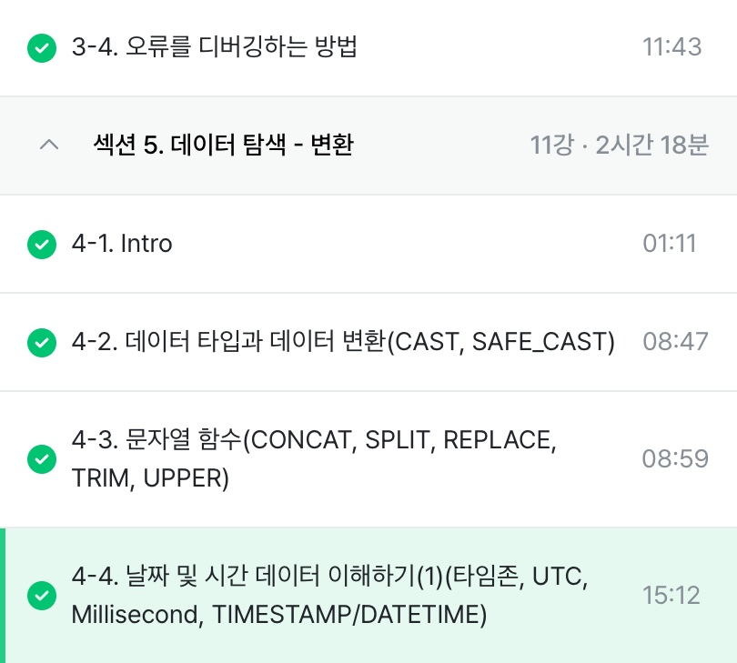

# 3-4. 오류를 디버깅하는 방법

대표적인 오류 카테고리: Syntax Error
- 문법을 지키지 않아 생기는 오류
- 해결방법: 구글링 / 챗지피티 / 공식문서

```sql
SELECT 
 COUNT(id, kor_name)
FROM basic.pokemon
```
- Number of arguments does not match for aggregate funtion COUNT: count는 1개만 들어갸아 함

```sql
SELECT
 type1,
 COUNT(id) AS cnt
FROM basic.pokemon
```
- SELECT list expression references column type1 a which is neither grouped nor aggregated
- SELECT 뒤에는 GROUP BY로 열을 참조해야 함

# 4-2. 데이터 타입과 데이터 변환(CAST, SAFE_CAST)

**데이터 타입**
- 숫자, 문자, 시간/날짜, 부울(T/F)

**데이터 타입이 중요한 이유**
- 보이는 것과 저장된 것의 차이가 존재

**자료 타입 변경하기**
- 자료 타입을 변경하는 함수: CAST

```SQL
SELECT
 CAST(1 AS STRING) # 숫자 1을 문자 1로 변경
```

- 더 안전하게 데이터 타입 변경하기: SAFE_CAST
- SAFE_가 붙은 함수는 변환이 실패할 경우 NULL 반환

```SQL
SELECT
 SAFE_CAST("카일스쿨" AS INT64)
```
-> NULL값 반환

**수학 함수**
- 수학 함수는 수학 연산(평균, 표준편차, 코사인 등)이 존재

<BR>

- 나누기는 X/Y 대신 SAFE_DIVIDE 함수 사용
- X, Y 중 하나라도 0인 경우 그냥 나누면 zero error 발생
```sql
SAFE_DIVIDE(X, Y)
```

# 4-3. 문자열 함수(CONCAT, SPLIT, REPLACE, TRIM, UPPER)

**CONCAT: 문자열 붙이기**
```SQL
SELECT
 CONCAT("안녕", "하세요", "!") AS result
```
- CONCAT으로 문자, 숫자를 넣을 땐 직접 넣은 거라 FROM 필요 X

**SPLIT: 문자열 분리하기**
```SQL
SELECT
 SPLIT("가, 나, 다, 라", ",") AS result
```
```sql
SELECT
 SPLIT("가, 나, 다, 라", ", ") AS result
```
- 나눌 기준이 되는 문자에 띄어쓰기까지 정확히 작성

**REPLACE: 특정 단어 수정하기**
```SQL
SELECT
 REPLACE("안녕하세요", "안녕", "실천") AS result
 # REPLACE(문자열 원본, 찾을 단어, 바꿀 단어)
```

**TRIM: 문자열 자르기**
```SQL
SELECT
 TRIM("안녕하세요", "하세요") AS result
```

**UPPER: 영어 소문자를 대문자로 변경**
```SQL
SELECT
 UPPER("abc") AS result
```

# 4-4. 날짜 및 시간 데이터 이해하기(1)

**시간 데이터 다루기**
- DATE: 년-월-일만 표시하는 데이터
- DATETIME: DATE와 TIME까지 표시하는 데이터, TIMEZONE 정보 없음

**시간 데이터 다루기-타임존**
- UTC: 국제적인 표준 시간(한국 시간: UTC+9)
- GMT: 영국 그리니치 천문대를 기준으로 지역에 따른 시간 차이 조정을 위해 생긴 구분선
- TIMESTAMP: UTC로부터 경과한 시간, 타임존 정보 있음

**millisecond, microsecond**

millisecond(ms)
- 시간의 단위, 천 분의 1초
- 빠른 반응이 필요한 분야에서 사용
- millisecond -> TIMESTAMP -> DATETIME으로 변경

microsecond
- 1/1,000ms = 1/1,000,000초

ex.
1704176819711ms - 2024-01-02 15:26:59(DATETIME)

```SQL
SELECT
 TIMESTAMP_MILLIS(1704176819711) AS milli_to_timestamp_value,
 TIMESTAMP_MICROS(1704176819711000) AS micro_to_timestamp_value,
 DATETIME(TIMESTAMP_MICROS(1704176819711000)) AS datetime_value,
 DATETIME(TIMESTAMP_MICROS(1704176819711000), 'Asia/Seoul') AS datetime_value_asia;
```
 
**시간 데이터끼리의 변환**
- TIMESTAMP <-> DATETIME 변환을 해야할 수 있음
- 보통 회사 Table에 timestamp로 저장된 경우가 많음

<br>

# 활동인증
