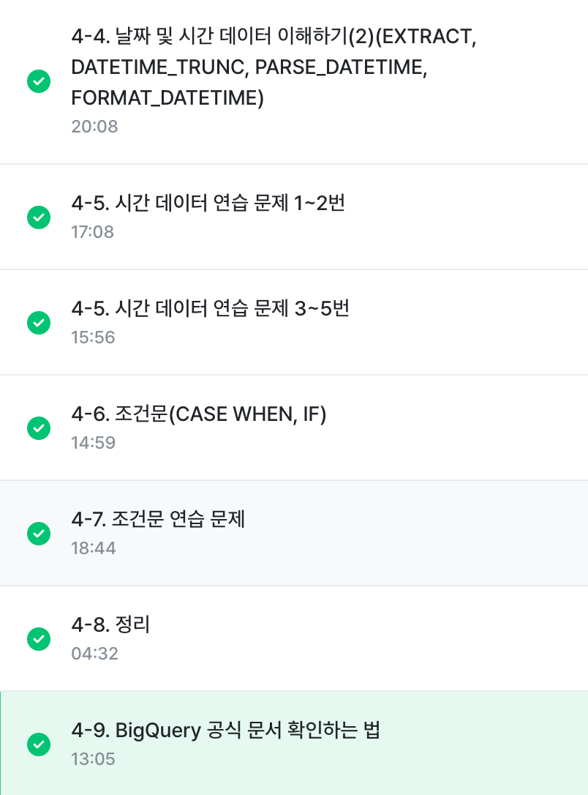

# 4-4. 날짜 및 시간 데이터 이해하기(2)

**CURRENT_DATETIME**
- CURRENT_DATETIME([time zone]): 현재 DATETIME 출력
```sql
SELECT
 CURRENT_DATE() AS current_date,
 CURRENT_DATE("Asia/Seoul") AS asia_date,
 CURRENT_DATE() AS current_date,
 CURRENT_DATE("Asia/Seoul") AS current_datetime_asia;
```
- *타임존의 유무로 시간이 달라질 수 있음*


**EXTRACT**
- DATETIME에서 특정 부분만 추출하고 싶은 경우
```SQL
SELECT
 EXTRACT(DATE FROM DATETIME '2024-01-02 14:00:00') AS date,
 EXTRACT(YEAR FROM DATETIME '2024-01-02 14:00:00') AS year
```
- 요일을 추출하고 싶은 경우
```sql
EXTRACT(DAYOFWEEK FROM datetime_col)
```
- 한 주의 첫날이 일요일인 [1, 7] 범위의 값을 반환 ex) 일요일: 1, 월요일 2, ..


**DATETIME_TRUNC**
- DATE와 HOUR만 남기고 싶은 경우 -> 시간 자르기
```SQL
DATETIME_TRUNC(datetime_col, HOUR)
```
- 2024-01-02 14:42:13을 HOUR로 자르면 2024-01-02 14:00:00

**PARSE_DATETIME**
- 문자열로 저장된 DATETIME을 DATETIME 타입으로 바꾸고 싶은 경우
```SQL
SELECT
 PARSE_DATETIME('%Y-%m-%d %H:%M:%S', '2024-01-11 12:35:35') AS parse_datetime;
```


**FORMAT_DATETIME**
- DATETIME 타입 데이터를 특정 형태의 문자열 데이터로 변환하고 싶은 경우
```
SELECT 
 FORMAT_DATETIME("%c", DATETIME "2024-01-11 12:35:35") AS formatted;
```


*PARSE_DATETIME: 문자열 -> DATETIME*
*FORMAT_DATETIME: DATETIME -> 문자열*


**LAST_DAY**
- 마지막 날을 알고 싶은 경우: 자동으로 월의 마지막 값을 게산해서 특정 연산을 할 경우
```SQL
SELECT
 LAST_DAY(DATETIME '2024-01-03 15:30:00') AS last_day,
 LAST_DAY(DATETIME '2024-01-03 15:30:00', MONTH) AS last_day_month,
 LAST_DAY(DATETIME '2024-01-03 15:30:00', WEEK) AS last_day_week,
 LAST_DAY(DATETIME '2024-01-03 15:30:00', WEEK(SUNDAY)) AS last_day_week)sum
```
- 기본: 월의 마지막 일자, 인자를 추가하면 해당 인자를 기준으로 마지막 날짜가 나옴
- WEEK = WEEK(SUNDAY)


**DATETIME_DIFF**
- 두 DATETIME의 차이를 알고 싶은 경우

```SQL
SELECT
 DATETIME_DIFF(first_datetime, second_datetime, DAY) AS day_diff1,
 DATETIME_DIFF(second_datetime, first_datetime, DAY) AS day_diff2,
 DATETIME_DIFF(first_datetime, second_datetime, MONTH) AS month_diff,
 DATETIME_DIFF(first_datetime, second_datetime, WEEK) AS week_diff,
FROM (
    SELECT
     DATETIME "2024-04-02 10:20:00" AS first_datetime,
     DATETIME "2021-01-01 15:30:00" AS second_datetime,
)
```
- diff1 - diff2 구조
- month_diff: 달 수의 차이 / week_diff: 주 수 차이

## SUMMARY
- CURRENT_DATETIME: 현재 DATETIME
- EXTRACT: DATETIME의 특정 부분 추출
- DATETIME_TRUNC: DATETIME의 특정 부분 자르기
- PARSE_DATETIME: 문자열 -> DATETIME
- FORMAT_DATETIME: DATETIME -> 문자열

<br>
<br>

# 4-6. 조건문

**조건문 함수**
- 만약 특정 조건이 충족되면, 어떤 행동을을 실행
- 특정 조건이 참일 때 A, 아니면 B: 조건에 따른 분기 처리가 필요한 경우
- 조건에 따라 다른 값을 표시하고 싶을 때
- CASE WHEN / IF

**조건문 함수가 사용되는 이유**
- 특정 카테고리를 하나로 합치는 전처리가 필요할 수 있음

**CASE WHEN**
- 여러 조건이 있을 경우 유용
```SQL
SELECT
 CASE
  WHEN 조건1 THEN 조건1이 참일 경우 결과
  WHEN 조건2 THEN 조건2가 참일 경우 결과
  ELSE 그 외 조건일 경우 결과
END AS 새로운_컬럼_이름


# 예시

FROM(
SELECT
 *,
 CASE
  WHEN (type1 IN ("ROCK", "GROUND") OR type2 IN ("ROCK", "GROUND"))_THEN "Rock&Ground"
 ELSE type1
 END AS new_type1
FROM basic.pokemon
)
GROUP BY
 new_type1
```

- 조건1, 조건2에 둘 다 해당하면 앞선 순서를 따름 -> *순서중요!*
- 문자열 함수(특정 단어 추출)에서 이슈가 자주 발생


**IF**
- 단일 조건일 경우 유용
```SQL
SELEC
 IF(1=1, '동일한 결과', '동일하지 않은 결과') AS result1,
 IF(1=2, '동일한 결과', '동일하지 않은 결과') AS result2
```


# 4-8. 정리

**컬럼 변환하기 정리**
```sql
SELECT
 col1,
 col2,
 col3
FROM table_name
WHERE <조건문>
GROUP BY <집계할 컬럼>
```

**데이터 타입**
- 숫자: 사칙연산, SAFE, DIVIDE
- 문자: CONCAT, SPLIT, REPLACE, TRIM, UPPER
- 시간/날짜: EXTRACT, DATETIME_TRUNC, PARSE_DATETIME
- 부울

**데이터 타입 변환하기**
- CAST / SAFE_CAST

**조건문**
- CASE WHEN / IF


# 4-9. BigQuery 공식 문서 확인하는 법

**개발 공식 문서**
- 해당 기술을 어떻게 사용하면 좋은지에 대해 문서를 제공
- 찾는 방법: 기술명+documentation


# 수행 인증
