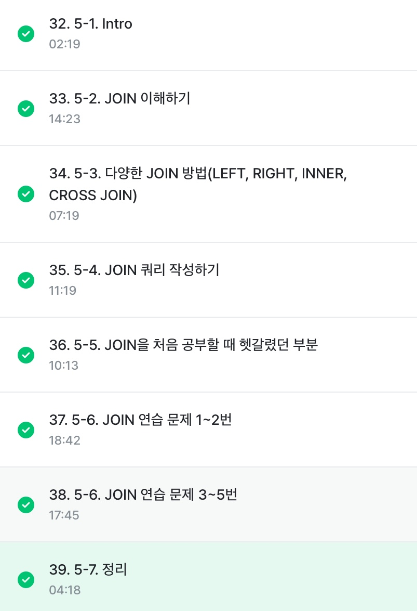

# 5-1. INTRO
- JOIN 이해하기
- 다양한 JOIN 방법
- JOIN 쿼리 작성하기
- JOIN을 처음 공부할 때 헷갈렸던 부분
- JOIN 연습 문제

# 5-2. JOIN 이해하기
- 서로 다른 데이터 테이블을 연결하는 것
- 공통적으로 존재하는 컬럼(key)이 있으면 JOIN 가능

**조인을 해야하는 이유**
- 관계형 데이터베이스 설계시 정규화 과정을 거침
  - 정규화는 중복을 최소화하게 데이터를 구조화
  - 데이터를 다양한 Table에 저장해서 필요할 때 JOIN 해서 사용
- 데이터 분석하는 관점에서는 미리 JOIN 되어 있는 것이 좋을 수 있지만, 개발 관점에선 분리되어 있는 것이 좋음 -> 데이터 웨어하우스에서 JOIN+필요한 연산을 해서 데이터 마트를 만들어서 활용


# 5-3. 다양한 JOIN 방법(LEFT, RIGHT, INNER, CROSS JOIN)

## 다양한 SQL JOIN 방법
- (INNER) JOIN: 두 테이블의 공통 요소만 연결 = 교집합 
- LEFT/RIGHT JOIN: 왼쪽/오른쪽 테이블 기준을 연결 
- FULL (OUTER) JOIN: 양쪽 기준으로 연결 = 합집합 
- CROSS JOIN: 두 테이블의 각각의 요소를 곱하기

# 5-4. JOIN 쿼리 작성하기

## SQL JOIN 쿼리 작성하는 흐름
1. 테이블 확인
- 테이블에 저장된 데이터, 컬럼 확인

2. 기준 테이블 정의
- 가장 많이 참고할 기준(case) 테이블 정의

3. JOIN Key 찾기
- 여러 table과 연결할 key(on) 정리

4. 결과 예상하기
- 결과 테이블을 예상해서 손, 엑셀로 작성

5. 쿼리 작성/검증
- 예상한 결과와 동일한 결과가 나오는지 확인

## SQL JOIN 문법
- FROM 하단에 JOIN 할 Table을 작성하고 ON 뒤에 공통된 컬럼(KEY)을 작성

```SQL
SELECT
 A.col1,
 A.col2,
 B.col11,
 B.col12
FROM table1 AS A
LEFT JOIN table2 AS B
ON A.key = B.key 
```
- cross join은 on 필수 x

# 5-5. JOIN을 처음 공부할 대 헷갈렸던 부분

**1. 여러 JOIN 중 어떤 것을 사용해야 할까?**
- 하려고 하는 작업의 목적에 따라 JOIN 선택하기
  - 교집합: INNER
  - 모두 다 조합: CROSS
  - 그게 아니라면 LEFT/RIGHT

**2. 어떤 Table을 왼쪽에 두고, 어떤 Table이 오른쪽에 가야할까?**
- left join이 되는 경우: 기준이 되는 table을 왼쪽에 두기

**3. 여러 Table을 연결할 수 있는걸까?**
- join의 개수에 한계는 없지만 너무 많이 join하고 있는지 확인(보통 3~5개)

```sql
SELECT
 table_a.col1,
 table_b.col2,
FROM table_a
LEFT JOIN table_b
ON table_a.key = table_b.key
```

**4. 컬럼은 모두 다 선택해야 할까?**
- 컬럼 선택은 데이터를 추출해서 무엇을 하고자?하냐에 따라 다름
- 사용하지 않을 컬럼은 선택하지 않는 것이 비용을 줄일 수 있음

**NULL 값**
- JOIN에선 연결할 값이 없는 경우 나타남

# 5-7. 정리

- JOIN: 여러 테이블을 연결해야 할 때 사용하는 문법
- KEY: 공통적으로 가지고 있는 컬럼 

```SQL
SELECT
 t1.col, t2.col2
FROM table1 AS t1
LEFT JOIN table2 AS t2
ON t1.key = t2.key
```

**JOIN의 종류**
- INNER / LEFT / RIGHT / FULL / CROSS 


# 수행 인증


