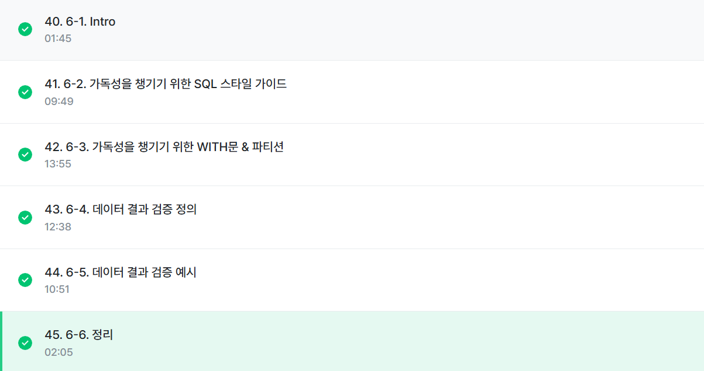

# 6-1. INTRO

## 데이터 결과 검증
- 가독성을 챙기기 위한 SQL 스타일 가이드
- 데이터 결과 검증
- 데이터 결과 검증 예시

<br>
<Br>


# 6-2. 가독성을 챙기기 위한 SQL 스타일 가이드
## 실수는 언제 발생하는가?
- 문법을 잘못 알고 있는 경우
- 데이터를 파악하지 않고 쿼리를 작성하는 경우
- 쿼리가 복잡한 경우 -> 단순화 해야함 

**1. 예약어는 대문자로 작성**
- SQL에서 문법적인 용도로 사용하고 있는 문자들은 대문자로 작성
```sql
SELECT
 col
FROM table
WHERE
```

**2. 컬럼 이름은 snake_case로 작성**
- 컬럼 이름은 CamelCase가 아닌 snake_case로 작성
  - CamelCase: 대소문자로 단어 구분 / snake_case: _로 단어 구분
- 회사의 기준이 CamelCase면 사용 -> *일관성이 중요*
```sql
SELECT
 col1 AS event_status
FROM table
``` 
**3. 명시적 이름 vs 암시적 이름**
- ALias로 별칭을 지을 때는 명시적 이름 적용


**4. 왼쪽 정렬**
- 기본적으로 왼쪽 정렬을 기준으로 작성

**5. 예약어나 컬럼은 한 줄에 하나씩 권장**
```sql
SELECT
 col1,
 col2,
 col3
FROM table
WHERE
```

**6. 쉼표는 컬럼 바로 뒤에**
-빅쿼리는 마지막 쉼표를 무시해서 뒤에 작성해도 무방

<br>
<Br>

# 6-3. 가독성을 챙기기 위한 WITH문&파티션
SQL 쿼리를 작성하다가 점점 복잡해짐(가독성 하락)
 -> 만약 아래 쿼리가 다른 곳에서도 필요하면 복사 붙여넣기

- WITH문을 사용해 쿼리를 정의해서 재사용 가능

## WITH 구문
- SELECT 구문에 이름을 정해주는 것과 유사
- 쿼리 내에서 반복적으로 사용할 수 있음

```SQL
WITH name_a AS (
    SELECT
     col1, col2, col3
     FROM table1
), name_b AS (
    SELECT
     col2
    FROM table2
)

SELECT
 col1, col2
FROM name_a
```

## PARTITION
- table엔 partition이 존재할 수 있음

**PARTITION을 사용하면 좋은 점**
1. 쿼리 성능 향상
- 전체 데이터를 스캔하는 것보다 파티션을 설정한 곳만 스캔하는 것이 더 빠름

2. 데이터 관리 용이
- 특정 일자의 데이터를 모두 변경하거나 삭제해야 하면 파티션을 설정해서 삭제할 수 있음

3. 비용
- 파티션에 해당하는 데이터만 스캔해서 비용을 줄일 수 있음

**PARTITION Table에서 쿼리하기**
- WHERE절에 파티션 컬럼에 대해 조건을 설정해서 사용

```SQL
SELECT
 id,
 player1_id,
 player2_id
FROM 'basic.battle'
WHERE battle_datetime BETWEEN DATETIME("2022-01-26") AND DATETIME_ADD("2024-01-26", INTERVAL 1 DAY)
```

<BR>
<bR>


# 6-4. 데이터 결과 검증 정의

**데이터 결과 검증(Data Result Validation)**
- SQL 쿼리 후 얻은 결과가 예상과 일치하는지 확인하는 과정
- 목적: 분석 결과의 정확성, 신뢰성 확보
- 내가 기대하는 예상 결과를 정의, 쿼리 작성, 두 개가 일치하는지 비교

** 데이터 결과를 검증하는 흐름**
1. 문제 정의 확인
- 구체적인 문제 정의, 요청 사항도 구체적으로 확인
2. Input/Output
- 데이터의 input과 원하는 형태의 output 작성
- input -> 중간 결과 <- output 에서 중간 결과 생각하기
3. 쿼리 작성
- 가독성 챙기기
4. 결과 비교
- 예상과 실제 쿼리 결과의 차이가 있는지 확인
- 오류가 있다면, 3번으로 돌아가기
5. 끝

**데이터 결과 검증할 때 활용하는 방식**
1. 특정 user_id로 필터링을 걸어서 확인
- 한 명의 데이터를 확인, 다른 user_id 3~4건 더 추가해서 확인 -> 동일한 결과가 나오면 조건 삭제

2. 샘플데이터 생성
- WITH문을 사용해 예시 데이터 생성 후 결과를 예상하고 쿼리 작성
- 복잡한 데이터에서 하기 전에, 쿼리 자체가 올바른지 확인할 때 주로 사용

# 6-5. 데이터 결과 검증 예시

EX1. 각 트레이너가 진행한 배틀의 승리 비율 계산, 배틀에 참여한 횟수가 9회 이상인 경우만 계산
1) 전체 데이터 파악
2) 특정 user_id 선정
3) 승률 직접 count: 결과 예상
4) 쿼리 작성
5) 실제와 비교
6) 맞다면 특정 유저 조건 제외

```sql
# 특정 user_id 선정
SELECT
 *
FROM 'basic.battle'
WHERE
 (player1_id=7) OR (player2_id=7)

# 통합 데이터 생성
SELECT
 *
FROM (
    SELECT
     id AS battle_id,
     player1_id AS trainer_id,
     winner_id
    FROM 'basic.battle'
    UNION ALL
    SELECT
     id AS battle_id,
     player2_id AS trainer_id,
     winner_id
    FROM 'basic.battle'
)
ORDER BY battle_id
```

# 6-6. 정리

** 데이터 결과를 검증하는 흐름**
1. 문제 정의 확인
2. Input/Output
3. 쿼리 작성
4. 결과 비교
5. 끝

**대표적으로 활용하는 SQL 문법**
- COUNT(*): 행 수를 확인, 의도한 데이터의 행 개수가 맞는가?
- NOT NULL: 특정 컬럼에 NULL이 존재하는가? 필수 필드가 비어있지 않는가?
- DISTINCT: 데이터의 고유값을 확인해 중복 여부 확인
- IF문, CASE WHEN: 의도와 같다면 TRUE, 아니면 FALSE


# 수행 인증
