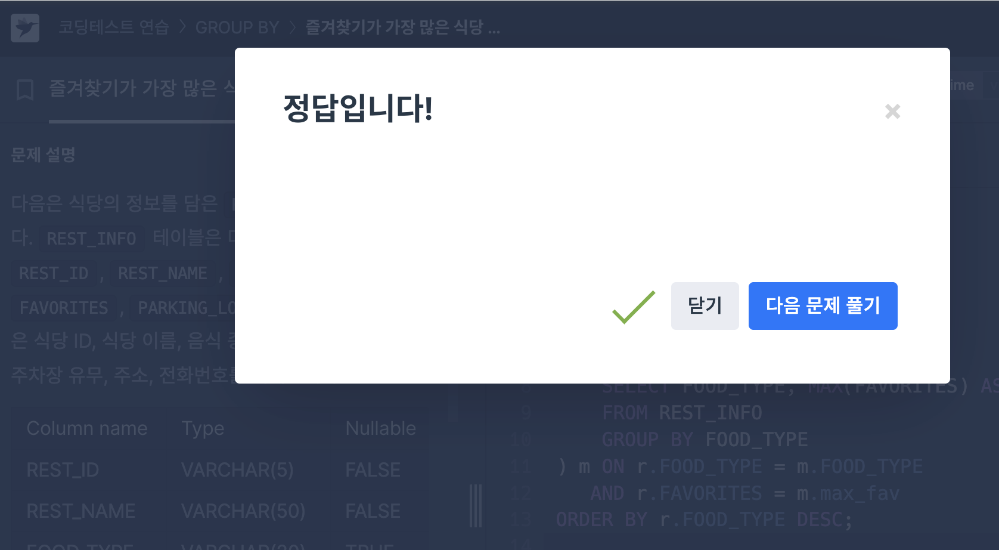
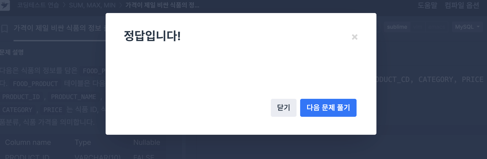

# SQL_ADVANCED 1주차 정규 과제 

## Week 1 : 서브쿼리 & CTE

📌**SQL_ADVANCED 정규과제**는 매주 정해진 주제에 따라 **MySQL 공식 문서 또는 한글 블로그 자료를 참고해 개념을 정리한 후, 프로그래머스 SQL 3문제**와 **추가 확인문제**를 직접 풀어보며 학습하는 과제입니다. 

이번 주는 아래의 **SQL_ADVANCED_0th_TIL**에 나열된 주제를 중심으로 개념을 학습하고, 주차별 **학습 목표**에 맞게 정리해주세요. 정리한 내용은 GitHub에 업로드한 후, **스프레드시트의 'SQL' 시트에 링크를 제출**해주세요. 


**👀 (수행 인증샷은 필수입니다.)** 

> 프로그래머스 문제를 풀고 '정답입니다' 문구를 캡쳐해서 올려주시면 됩니다. 


## SQL_ADVANCED_1st_TIL 

### 15.2.15. SubQueries

#### 특히 15.2.15.1 ~ 15.2.15.7 (Scalar, EXISTS, Correlated, Derived 등) 

### 15.2.20 WITH (Common Table Expressions)

- `WITH RECURSIVE`에 대한 내용은 추후에 공부합니다. 해당 링크에서 `WITH`에 해당하는 부분만 정리해보세요. 


## 🏁 주차별 학습 (Study Schedule)

| 주차  | 공부 범위               | 완료 여부 |
| ----- | ----------------------- | --------- |
| 1주차 | 서브쿼리 & CTE          | ✅         |
| 2주차 | 집합 연산자 & 그룹 함수 | 🍽️         |
| 3주차 | 윈도우 함수             | 🍽️         |
| 4주차 | Top N 쿼리              | 🍽️         |
| 5주차 | 계층형 질의와 셀프 조인 | 🍽️         |
| 6주차 | PIVOT / UNPIVOT         | 🍽️         |
| 7주차 | 정규 표현식             | 🍽️         |

<br>


### 공식 문서 활용 팁

>  **MySQL 공식 문서는 영어로 제공되지만, 크롬 브라우저에서 공식 문서를 열고 이 페이지 번역하기에서 한국어를 선택하면 번역된 버전으로 확인할 수 있습니다. 다만, 번역본은 문맥이 어색한 부분이 종종 있으니 영어 원문과 한국어 번역본을 왔다 갔다 하며 확인하거나, 교육팀장의 정리 예시를 참고하셔도 괜찮습니다.**


# 1️⃣ 학습 내용 

> 아래의 링크를 통해 *MySQL 공식문서*로 이동하실 수 있습니다.
>
> - SubQueries : MySQL 공식문서 
>
> https://dev.mysql.com/doc/refman/8.0/en/subqueries.html
>
> (한국어 버전)
> https://dart-b-official.github.io/posts/mysql-subqueries/


> - CTE(공통 테이블 표현식) : MySQL 공식문서
>
> https://dev.mysql.com/doc/refman/8.0/en/with.html
>
> (한국어 버전)
> https://dart-b-official.github.io/posts/mysql-cte/

<br>
<br>
<!-- 여기까진 그대로 둬 주세요-->


# 2️⃣ 학습 내용 정리하기

---

 # 1. 서브쿼리

~~~
✅ 학습 목표 :
* SubQueries에 대한 문법을 이해하고 활용할 수 있다.  
~~~

### 서브쿼리
- 하나의 SQL문 안에 포함된 SELECT 문
```sql
SELECT *
FROM t1
WHERE col1 = (                 -- 서브쿼리
    SELECT col1 FROM t2
) ; 
```
- 서브쿼리는 반드시 괄호로 감싸야 함
- 서브쿼리 중첩 가능

**서브쿼리에서 허용되는 요소**
- DISTINCT / GROUP BY / ORDER BY / LIMIT
- JOIN / 인덱스 힌트 / UNION / 함수 / 주석

**서브쿼리를 사용할 수 있는 외부 구문**
- SELECT / INSERT / UPDATE / DELETE / SET / DO

### 스칼라 서브쿼리(scalar subquery)
- 가장 단순한 형태의 서브쿼리, 단일값 반환
- 표현식의 일부로 사용 가능, 반드시 괄호 사용

```sql
CREATE TABLE t1 (s1 INT, s2 CHAR(5) NOT NULL);
INSERT INTO t1 VALUES(100, 'abcde');
SELECT (SELECT s2 FROM t1);
```
- 단일값 'abcde'를 반환하는 서브쿼리
- CHAR 타입, 길이 5
- 원래 컬럼 정의(NOT NULL)과 별개로 비어있으면 NULL 가능

**스칼라 서브쿼리 사용 제한**
- LIMIT: 정수 리터럴만 허용 / LOAD DATA: 문자열 리터럴 파일 이름만 허용


### 서브쿼리를 이용한 비교

```sql
... WHERE 'a' = (SELECT column1 FROM t1)
```

1. JOIN으로는 불가능한 비교
```sql
# t2의 col2 최대값과 같은 값을 가지는 col1 찾기
SELECT * FROM t1
  WHERE col1 = (SELECT MAX(col2) FROM t2);
```

2. 특정 값이 2번 등장하는 경우 찾기
```sql
# t1 테이블에서 특정 값이 2번 등장하는 경우
SELECT * FROM t1 AS t
  WHERE 2 = (SELECT COUNT(*) FROM t1 WHERE t1.id = t.id);
```
- **집계를 포함하기 때문에 단순 JOIN으로는 표현 불가**

**주의 사항**
- 서브쿼리를 스칼라값과 비교하려면, 해당 서브쿼리도 단일 값 반환 필요


### 서브쿼리 w/ ANY, IN, SOME 

구문
```sql
operand comparison_operator ANY (subquery)
operand IN (subquery)
operand comparison_operator SOME (subquery)
```
- comparison_operator: `=, >, <, >=, <=, <>, !=`


**ANY**
- 서브쿼리에서 반환된 값들 중 하나라도 조건을 만족하면 TRUE를 반환

```sql
SELECT s1 FROM t1 WHERE s1 > ANY (SELECT s1 FROM t2);
```
- *만약 t1에 (10)이라는 행이 있고 t2에 (21, 14, 7)이 있으면 TRUE*

**IN**
- =ANY의 별칭(alias)

```sql
SELECT s1 FROM t1 WHERE s1 = ANY (SELECT s1 FROM t2);
SELECT s1 FROM t1 WHERE s1 IN    (SELECT s1 FROM t2);
```
- 동일한 쿼리

**주의 사항**
- IN과 =ANY는 항상 동의어는 아님
- IN은 표현식 리스트도 받을 수 있음
- =ANY는 서브쿼리만 사용 가능

**SOME**
- ANY의 또 다른 별칭
```sql
SELECT s1 FROM t1 WHERE s1 <> ANY  (SELECT s1 FROM t2);
SELECT s1 FROM t1 WHERE s1 <> SOME (SELECT s1 FROM t2);
```
- 동일한 쿼리


### 서브쿼리 w/ ALL

구문
```sql
operand comparison_operator ALL (subquery)
```

**ALL의 의미**
- 비교 연산자 뒤에 와야 함
- 서브쿼리에서 반환된 모든 값에 대해 비교 결과가 TRUE일 때 TRUE를 반환 함

```sql
SELECT s1 FROM t1 WHERE s1 > ALL (SELECT s1 FROM t2);
```
- *t1에 (10)이라는 행이 있고, t2에 (-5, 0, 5)가 있으면*
    - *10 > -5, 10 > 0, 10 > 5 전부 만족 -> TRUE*

**빈 테이블과 NULL 값 처리**

1. t2가 비어있는 경우(TRUE)
```sql
SELECT * FROM t1 WHERE 1 > ALL (SELECT s1 FROM t2);
```
- 결과 TRUE 반환
- ALL(빈 집합) -> TRUE

2. t2가 비어있는 경우(NULL)
```sql
SELECT * FROM t1 WHERE 1 > (SELECT s1 FROM t2);
# 또한
SELECT * FROM t1 WHERE 1 > ALL (SELECT MAX(s1) FROM t2);
``` 
- 스칼라 서브쿼리가 비면 -> NULL(비교불가)
- 집계 함수 결과가 NULL이면 -> 비교 시 NULL
- NULL값과 빈 테이블은 서브쿼리 작성 시 반드시 고려해야 하는 엣지 케이스 


### NOT IN과의 관계
- NOT IN은 <> ALL의 별칭
```sql
SELECT s1 FROM t1 WHERE s1 <> ALL (SELECT s1 FROM t2);
SELECT s1 FROM t1 WHERE s1 NOT IN (SELECT s1 FROM t2);
```
- 동일한 쿼리
- ALL 및 NOT IN 구문에서도 TABLE 사용 가능(단일 컬럼만 포함, 서브쿼리가 컬럼 표현식에 의존하지 않음)

### 서브쿼리 w/ EXISTS, NOT EXISTS
- EXISTS 서브쿼리: 서브쿼리가 한 행이라도 반환하면 TRUE
- NOT EXISTS 서브쿼리: 서브쿼리가 아무 행도 반환하지 않으면 TRUE 

```sql
SELECT column1 FROM t1 WHERE EXISTS (SELECT * FROM t2);
```
- t2가 비어있지 않다면 EXISTS -> TRUE
- t2가 비어있다면 EXISTS -> FALSE 

**에시**
```sql
# 한 개 이상의 도시에서 존재하는 상점 유형 찾기
SELECT DISTINCT store_type FROM stores   -- 중복 제거하여 store_type 컬럼 선택
  WHERE EXISTS (   -- 서브쿼리 결과가 한 행이라도 존재하면 TRUE
    SELECT * FROM cities_stores
      WHERE cities_stores.store_type = stores.store_type
  );
```
- EXSIT: 존재 여부만 판단, 실제 값 반환은 않음

**EXIST vs IN**
- EXIST: 조건 만족 여부만 체크
- IN: 실제 값 집합과 비교

### 상관 서브쿼리
- 서브쿼리 안에서 외부 쿼리에 있는 테이블을 참조하는 경우

```sql
SELECT * FROM t1
  WHERE col1 = ANY (
    SELECT col1 FROM t2
    WHERE t2.col2 = t1.col2
  );
```
- 여기서 서브쿼리는 t1의 col2를 참조하고 있음
- 비록 t1이 서브쿼리의 FROM 절에는 없지만, 외부 쿼리에서 찾아 참조


# 2. CTE

~~~
✅ 학습 목표 :
* CTE에 대한 문법을 이해하고 활용할 수 있다. 
~~~

### WITH(common table expressions)

**CTE(Common Table Expressions)**
- 하나의 SQL문 내에서만 존재하는 이름 있는 임시 결과 집합
- 해당 문장에서 여러 번 참조할 수 있으며, 특히 복잡한 쿼리를 구조적으로 나누고 가독성을 높이는데 유용

```sql
WITH
  cte1 AS (SELECT a, b FROM table1),
  cte2 AS (SELECT c, d FROM table2)
SELECT b, d FROM cte1 JOIN cte2
WHERE cte1.a = cte2.c;
```
- cte1, cte2는 각각의 하위 쿼리 결과 집합을 이름으로 정의
- 이후 SELECT 문에서 마치 테이블처럼 참조 가능
- CTE 안에서 다른 CTE 참조 가능

**CTE 구문 규칙**
- WITH 절은 SELECT, UPDATE, DELETE 문 앞에 위치할 수 있음
- INSERT, REPLACE, CREATE TABLE/VIEW, DECLARE CURSOR, EXPLAIN 문에서도 사용 가능
- 하나의 문장 레벨에는 WITH 절 하나만 허용
- 여러 CTE는 , 로 구분하여 나열
- 이름 해석 순서는 서브쿼리 > CTE > 기본 테이블/뷰 순서

**컬럼 이름 결정 규칙**
- CTE 정의 시 (col1, col2, ..)처럼 이름을 지정하면 해당 컬럼명 사용
- 지정하지 않으면 첫 번째 SELECT 문의 select list에서 컬럼명을 가져옴

**CTE vs Derived Tables**
- 공통점: 이름이 있고, 단일 문장에서만 존재
- 차이점: 파생 테이블은 한 번만 참조 가능 / CTE는 여러 번 참조 가능 / CTE는 재귀 가능 / CTE의 가독성이 더 높음


<br>

<br>

---

# 3️⃣ 실습 문제

**두 문제 중에서 한 문제는 SubQuery와 CTE를 사용한 방법을 각각 활용해서 2개의 답변을 제시해주세요**

## 프로그래머스 문제 

https://school.programmers.co.kr/learn/courses/30/lessons/131123

> 즐겨찾기가 가장 많은 식당 정보 출력하기 (GROUP BY, SubQuery) : Lev 3

```sql
SELECT r.FOOD_TYPE,
       r.REST_ID,
       r.REST_NAME,
       r.FAVORITES
FROM REST_INFO r
JOIN (
    SELECT FOOD_TYPE, MAX(FAVORITES) AS max_fav
    FROM REST_INFO
    GROUP BY FOOD_TYPE
) m ON r.FOOD_TYPE = m.FOOD_TYPE
   AND r.FAVORITES = m.max_fav
ORDER BY r.FOOD_TYPE DESC ;
```
- MAX(COL) 바로 사용 불가 -> **서브쿼리 이용**
- JOIN: 집계된 결과와 원본 테이블을 연결해 실제 행을 가져옴


https://school.programmers.co.kr/learn/courses/30/lessons/131115

> 가격이 제일 비싼 식품의 정보 출력하기 (SUM, MAX, MIN, SubQuery) : Lev 2

```sql
SELECT PRODUCT_ID, PRODUCT_NAME, PRODUCT_CD, CATEGORY, PRICE
FROM FOOD_PRODUCT
WHERE PRICE = (
    SELECT MAX(PRICE)
    FROM FOOD_PRODUCT
) ; 
```

**서브쿼리 + MAX**
```sql
# col에서 최댓값 찾기
WHERE col = (
    SELECT MAX(col)
    FROM table
)
```

---

## 문제 인증란





---


## 문제 1

> **🧚 예린이는 최근 여러 주문 데이터를 분석하는 업무를 맡게 되었습니다. 특정 고객의 주문 이력을 분석하기 위해, 다음과 같이 최근 30일간 주문만 필터링한 CTE를 사용해 쿼리를 작성했습니다.**

~~~sql
WITH RecentOrders AS (
  SELECT *
  FROM Orders
  WHERE order_date >= DATE_SUB(CURDATE(), INTERVAL 30 DAY)
)
SELECT customer_id, COUNT(*) AS recent_order_count
FROM RecentOrders
GROUP BY customer_id;
~~~

> **그런데 예린이는 "이 쿼리를 WITH 없이, 서브쿼리 방식으로 바꿔서 실행해보라" 는 피드백을 받았고, 서브쿼리로 작성해보려 했지만 익숙하지 않아 SQL_ADVANCED를 듣는 학회원분들에게 도움을 요청하고 있습니다. 예린이의 쿼리를 WITH 없이 서브쿼리로 변환해보세요. 그리고 두 방식의 차이점을 설명해보고, 각각의 장단점을 정리해보세요**


```
SELECT o.customer_id, COUNT(*) AS recent_order_count
FROM (
    SELECT *
    FROM Orders
    WHERE order_date >= DATE_SUB(CURDATE(), INTERVAL 30 DAY)
) AS o
GROUP BY o.customer_id ;
```
- CTE(`WWITH`): 쿼리 상단에 이름 붙인 임시 결과집합 -> 재귀 필요시 사용
- 서브쿼리: FROM table AS alias로 바로 넣는 인라인 뷰


## 참고자료

서브쿼리를 사용하는 이유가 너무 어려우신 분들을 위해 참고자료를 첨부합니다. 아래 블로그를 통해서 더욱 쉽게 공부해보시고 문제를 풀어보세요.

1. [SQL] 서브쿼리는 언제 쓰는걸까? 
   https://project-notwork.tistory.com/38

2. [SQLD] 서브 쿼리 (SubQeury) 개념 및 종류
   https://bommbom.tistory.com/entry/%EC%84%9C%EB%B8%8C-%EC%BF%BC%EB%A6%ACSub-Query-%EA%B0%9C%EB%85%90-%EB%B0%8F-%EC%A2%85%EB%A5%98


### 🎉 수고하셨습니다.
