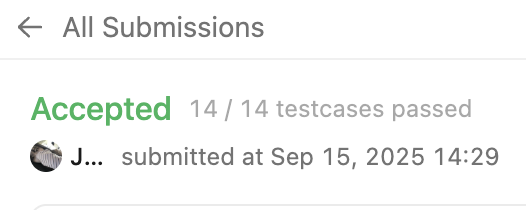

# SQL_ADVANCED 2주차 정규 과제 

## Week 2 :집합 연산자 & 그룹 함수

📌**SQL_ADVANCED 정규과제**는 매주 정해진 주제에 따라 **MySQL 공식 문서 또는 한글 블로그 자료를 참고해 개념을 정리한 후, 프로그래머스/ Solvesql / LeetCode에서 SQL 3문제**와 **추가 확인문제**를 직접 풀어보며 학습하는 과제입니다. 

이번 주는 아래의 **SQL_ADVANCED_2nd_TIL**에 나열된 주제를 중심으로 개념을 학습하고, 주차별 **학습 목표**에 맞게 정리해주세요. 정리한 내용은 GitHub에 업로드한 후, **스프레드시트의 'SQL' 시트에 링크를 제출**해주세요. 


**👀 (수행 인증샷은 필수입니다.)** 

> 프로그래머스 문제를 풀고 '정답입니다' 문구를 캡쳐해서 올려주시면 됩니다. 


## SQL_ADVANCED_2nd

**1. 집합 연산자**

### 15.2.18. UNION Clause

### 15.2.14. Set Operations with UNION, INTERSECT

- UNION, UNION ALL 중심으로 개념을 정리하고, INTERSECT, EXCEPT는 구문이 어떤 기능을 하는지 간단히만 알아봅니다. EXCEPT와 INTERSECT는 대부분 MySQL 버전에서 공식 지원되지 않기 때문에, **이번주 학습은 `UNION, UNION ALL` 만 집중적으로 정리해주세요.**

**2. 그룹 함수 (집계 함수)**

### 14.19.1. Aggregate Function Descriptions


## 🏁 주차별 학습 (Study Schedule)

| 주차  | 공부 범위               | 완료 여부 |
| ----- | ----------------------- | --------- |
| 1주차 | 서브쿼리 & CTE          | ✅         |
| 2주차 | 집합 연산자 & 그룹 함수 | ✅         |
| 3주차 | 윈도우 함수             | 🍽️         |
| 4주차 | Top N 쿼리              | 🍽️         |
| 5주차 | 계층형 질의와 셀프 조인 | 🍽️         |
| 6주차 | PIVOT / UNPIVOT         | 🍽️         |
| 7주차 | 정규 표현식             | 🍽️         |


### 공식 문서 활용 팁

>  **MySQL 공식 문서는 영어로 제공되지만, 크롬 브라우저에서 공식 문서를 열고 이 페이지 번역하기에서 한국어를 선택하면 번역된 버전으로 확인할 수 있습니다. 다만, 번역본은 문맥이 어색한 부분이 종종 있으니 영어 원문과 한국어 번역본을 왔다 갔다 하며 확인하거나, 교육팀장의 정리 예시를 참고하셔도 괜찮습니다.**


# 1️⃣ 학습 내용 

> 아래의 링크를 통해 *MySQL 공식문서*로 이동하실 수 있습니다.
>
> - 15.2.18. UNION Clause : MySQL 공식문서 
>
> https://dev.mysql.com/doc/refman/8.0/en/union.html
>
> - 15.2.14. Set Operations with UNION, INTERSECT : MySQL 공식문서
>
> https://dev.mysql.com/doc/refman/8.0/en/set-operations.html
>
> (한국어 버전) https://dart-b-official.github.io/posts/mysql-UNION/
>
> - 14.19.1. Aggregate Function Descriptions : MySQL 공식문서
>
> https://dev.mysql.com/doc/refman/8.0/en/aggregate-functions.html
>
> (한국어 버전) https://dart-b-official.github.io/posts/mysql-aggregate_function/


<!-- 여기까진 그대로 둬 주세요-->

# 2️⃣ 학습 내용 정리하기

## 1. 집합 연산자

~~~
✅ 학습 목표 :
* UNION과 UNION ALL의 차이와 사용법을 이해한다.
* 중복 제거 여부, 컬럼 정렬 조건 등을 고려하여 올바르게 집합 연산자를 사용할 수 있다. 
~~~

```sql
query_expression_body UNION [ALL | DISTINCT] query_block
    [UNION [ALL | DISTINCT] query_expression_body]
    [...]
```
- MySQL 8.0에서는 괄호 없이도 right-deep join이 허용
- 최상위문에서도 UNION의 좌측 중첩이 가능
- 잠금 절은 UNION이 아닌 쿼리에서만 허용, 잠금 절을 포함하는 SELECT문은 반드시 괄호 사용


### SQL 집합 연산 개요
- UNION: 두 쿼리 블록의 모든 결과를 종합하고, 중복 제거 *(=합집합)*
- INTERSECT: 두 쿼리 블록 모두에 공통으로 존재하는 행만 반환, 중복 제거 *(=교집합)*
- EXCEPT: 두 쿼리 블록 A, B에서 A에만 존재하고 B에서는 없는 행 반환, 중복 제거 *(=차집합)*

<br>

모든 집합 연산자는 ALL, DISTINCT를 지원
- ALL: 중복을 제거하지 않음
- DISTINCT: 중복을 제거, 기본 동작

```sql
query_expression_body:
FinalQuery -- 최종 쿼리
 ├─ QuerySet -- 교집합 단위
 │   ├─ QueryUnit -- 쿼리 단위
 │   │   └─ QueryBlock (SELECT, VALUES, TABLE)
 │   └─ INTERSECT ...
 └─ UNION / EXCEPT ...

```

### TABLE/VALUES 문과 집합 연산

```sql
TABLE t1 UNION TABLE t2;
VALUES ROW(4,-2), ROW(5,9) UNION TABLE t2;
``` 
- 컬럼 이름을 맞추려면 SELECT와 별칭 사용


### ORDER BY와 LIMIT

```sql
(SELECT a FROM t1 WHERE a=10 ORDER BY a LIMIT 10)
UNION
(SELECT a FROM t2 WHERE a=11 ORDER BY a LIMIT 10);
```
- 개별 쿼리 블록에 적용하려면 괄호로 묶기
- 전체 결과에 적용하려면 마지막에 배치
- **VALUES**도 ORDER BY, LIMIT 가능하지만 **WHERE은 불가**

## 집합 연산의 제약 사항

1. 제약 
- HIGH_PRIORITY: 첫 번째 SELECT에서는 무효, 이후 SELECT에서는 오류
- INTO: 마지막 SELECT에서만 사용 가능

2. 집합 연산과 집계 함수
```sql
TABLE t1 INTERSECT TABLE t2 ORDER BY MAX(x);
-- 오류 발생
```
- ORDER BY 절에서 집계 함수 사용 불가

3. 잠금 절(FOR UPDATE, LOCK IN SHARE MODE)
- UNION 등과 함께 쓸면 반드시 괄호로 묶어야 함


## 2. 그룹함수

~~~
✅ 학습 목표 :
* COUNT, SUM, AVG, MAX, MIN 함수의 기본 사용법을 익힌다.
* GROUP BY와 HAVING 절을 적절히 활용할 수 있다.
* NULL과 집계 함수가 어떻게 상호작용하는지 이해한다. 
~~~

### 집계함수 표

| 함수 | 설명 |
|------|------|
| AVG() | 인자의 평균값 반환 |
| BIT_AND() | 비트 AND 반환 |
| BIT_OR() | 비트 OR 반환 |
| BIT_XOR() | 비트 XOR 반환 |
| COUNT() | 반환된 행 수 반환 |
| COUNT(DISTINCT) | 서로 다른 값의 개수 반환 |
| GROUP_CONCAT() | 문자열 연결 결과 반환 |
| JSON_ARRAYAGG() | 결과 집합을 단일 JSON 배열로 집계 |
| JSON_OBJECTAGG() | 결과 집합을 단일 JSON 객체로 집계 |
| MAX() | 최댓값 반환 |
| MIN() | 최솟값 반환 |
| STD() | 모표준편차(= STDDEV_POP()) |
| STDDEV() | 모표준편차(= STDDEV_POP()) |
| STDDEV_POP() | 모표준편차 |
| STDDEV_SAMP() | 표본표준편차 |
| SUM() | 합계 반환 |
| VAR_POP() | 모분산 |
| VAR_SAMP() | 표본분산 |
| VARIANCE() | 모분산(= VAR_POP()) |

- 기본적으로 집계 함수는 NULL 값을 무시

### 반환 타입 요약 

- 분산·표준편차 함수: 숫자 인자에 대해 DOUBLE 반환
    - DOUBLE -> 정수 입력을 받아도 최종적으로 실수(소수점 포함)을 반환
    ```sql
    SELECT VAR_POP(1), VAR_POP(1.0);
    ``` 
    - 1은 정수지만 결과는 0.0 (DOUBLE)
    - 1.0도 실수라서 결과는 역시 0.0 (DOUBLE)

- SUM(), AVG():
    - 정밀-값 인자(INTEGER, DECIMAL): DECIMAL 반환
    - 근사-값 인자(FLOAT, DOUBLE): DOUBLE 반환

### 시간형 주의
- SUM(), AVG()는 시간형에 직접 동작하지 않음
```sql
SELECT SEC_TO_TIME(SUM(TIME_TO_SEC(time_col))) FROM tbl_name;
-- 1. 초 단위 정수로 변환 2. 초 누적 합(sum) 3. 합계를 다시 TIME 형식으로 변환
SELECT FROM_DAYS(SUM(TO_DAYS(date_col))) FROM tbl_name; 
-- 1. 일수 정수로 변환 2. 선형적인 일수에서 연산 3. 일수를 다시 DATE로 변환
``` 
- SUM/AVG()로 인해 타입이 바뀐 것을 다시 TIME 형식으로 변환

### AVG()
- 평균값 반환
```sql
SELECT student_name, AVG(test_score)
FROM student
GROUP BY student_name;
```

### BIT_AND / OR / XOR

| 함수 | 설명 | 세부 동작 | 기본 반환 |
|------|------|-----------|-----------|
| BIT_AND(expr) | 모든 비트에 대한 AND | - 모든 값의 비트가 1일 때만 1 반환<br>- 문자열: 동일 길이 이진 문자열끼리만 연산<br>- 숫자: 64비트 정수로 변환 후 AND | 일치 행 없으면 `모든 비트가 1` 값 반환 |
| BIT_OR(expr)  | 모든 비트에 대한 OR  | - 하나라도 1이면 1 반환<br>- 평가 방식은 BIT_AND와 동일 | 일치 행 없으면 `모든 비트가 0` 값 반환 |
| BIT_XOR(expr) | 모든 비트에 대한 XOR | - 값이 홀수 번 1이면 1 반환 (짝수 번 1이면 0)<br>- 평가 방식은 BIT_AND와 동일 | 일치 행 없으면 `모든 비트가 0` 값 반환 |

```SQL
SELECT 
  BIT_AND(val) AS and_result,
  BIT_OR(val)  AS or_result,
  BIT_XOR(val) AS xor_result
FROM (SELECT 6 AS val UNION ALL SELECT 3 UNION ALL SELECT 1) t;
```
- 비트 단위 집계를 해주는 특수 함수

### COUNT
- 값의 개수 반환
```sql
SELECT s.student_name, COUNT(*)
FROM student s JOIN course c ON s.student_id = c.student_id
GROUP BY student_name;
``` 

### GROUP_CONCAT
- 그룹 내 NULL이 아닌 값들을 연결한 문자열
- 모두 NULL이면 NULL
```sql
GROUP_CONCAT([DISTINCT] expr [, expr ...]
  [ORDER BY {unsigned_integer | col_name | expr} [ASC | DESC] [, col_name ...]]
  [SEPARATOR str_val])
```
- 기본 구분자: 콤마(,), SEPARATOR로 구분자 제거 가능

### MIN/MAX
- 최소, 최댓값 반환 

### SUM
- 합계를 반환
- DISTINCT로 서로 다른 값만 합산


<br><br>

---

# 3️⃣ 실습 문제

https://leetcode.com/problems/customers-who-never-order/

> LeetCode 183. Customers Who never Order
>
> 학습 포인트 : 주문 내역이 없는 고객을 찾기 위한 패턴 익히기  
```sql
SELECT c.name AS Customers
FROM Customers c
LEFT JOIN Orders o
  ON c.id = o.customerId
WHERE o.customerId IS NULL;
```
- Customer 기준으로 Orders와 `LEFT JOIN`
- 주문이 없는 고객은 o.customerID가 NULL -> 해당 고객들 이름만 선택


https://leetcode.com/problems/department-highest-salary/description/

> LeetCode 184. Department Highest Salary
>
> 학습 포인트 : 부서별 최고 연봉자 추출을 위한 **그룹별 정렬 / 필터링** 방식 이해하기
```sql
SELECT d.name AS Department,
       e.name AS Employee,
       e.salary AS Salary
FROM Employee e
JOIN Department d
  ON e.departmentId = d.id
WHERE e.salary = (
    SELECT MAX(salary)
    FROM Employee
    WHERE departmentId = e.departmentId
);
```
- 부서별 `MAX(salary)` 구하는 서브쿼리
- 현재 직원의 급여`e.salary = (MAX(salary))`이면 출력

---

## 문제 인증란





---

# 확인문제

## 문제 1

> **🧚동혁이는 SQL 문제를 풀면서 `UNION과 UNION ALL`의 차이를 명확히 이해하지 못해 중복된 값이 생기거나 누락되는 문제를 계속 겪고 있습니다.** 아래는 동혁이가 작성한 쿼리입니다.

~~~sql
SELECT name FROM member
UNION
SELECT name FROM blackList;
~~~

> **그런데 예상과 달리 blacklist에만 있는 이름이 결과에 안 나오거나, 중복된 이름이 사라져서 헷갈리고 있습니다. UNION과 UNION ALL의 차이를 설명하고, 중복 포함 여부에 따라 어떤 경우에 어떤 쿼리를 써야 하는지 예시와 함께 설명해주세요**

<br>

~~~
1. UNION 
- 두 SELECT 결과를 합친 후 중복 제거 
- blaclist에만 있는 이름이 빠지지는 않지만, 두 테이블 모두에 있는 동일한 이름은 하나만 남음

2. UNION ALL
- 두 SELECT 결과를 그대로 합치고, 중복 제거 x
- 중복된 일므이 있으면 그대로 여러 번 출력

-> 모든 이름을 중복 포함하여 보고 싶으면 UNION ALL을 사용해야 함 
~~~

## 참고자료
그룹 함수가 많아서 중요하게 많이 쓰이는 함수들을 정리해놓은 참고자료를 첨부합니다. 아래 블로그를 통해서 더욱 쉽게 공부해보시고 문제를 풀어보세요.
1. [SQL 10] 그룹 함수, GROUP BY 절, HAVING 절
https://keep-cool.tistory.com/37

또한, MySQL 문서 이외에 Oracle 함수에서 사용하는 그룹함수에 대한 소개도 같이 첨부합니다. SQLD 시험 준비하시는 분이 있다면 이 자격증 시험에서는 Oracle 언어를 기반으로 문제가 출제하오니 아래 블로그도 같이 공부해보세요. (선택사항입니다.)
2. 그룹 함수 (Group FUNCTION)
https://dkkim2318.tistory.com/48

<br>

### 🎉 수고하셨습니다.