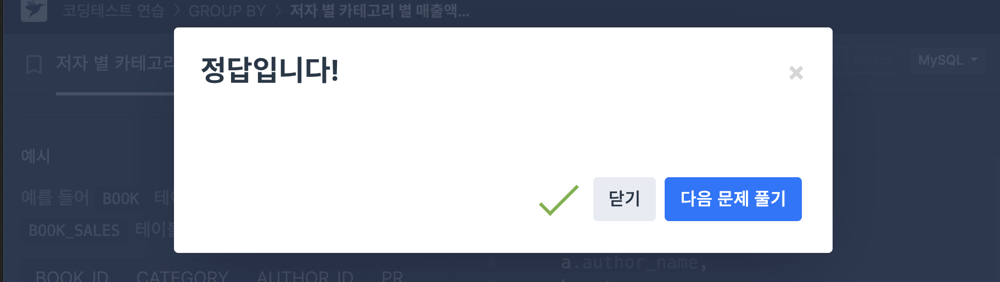

# SQL_ADVANCED 5주차 정규 과제 

## Week 5 : 계층형 질의 & 셀프 조인

📌**SQL_ADVANCED 정규과제**는 매주 정해진 주제에 따라 **MySQL 공식 문서 또는 한글 블로그 자료를 참고해 개념을 정리한 후, 프로그래머스 SQL 문제 3문제**와 **추가 확인문제**를 직접 풀어보며 학습하는 과제입니다. 

이번 주는 아래의 **SQL_ADVANCED_5th_TIL**에 나열된 주제를 중심으로 개념을 학습하고, 주차별 **학습 목표**에 맞게 정리해주세요. 정리한 내용은 GitHub에 업로드한 후, **스프레드시트의 'SQL' 시트에 링크를 제출**해주세요. 


**(수행 인증샷은 필수입니다.)** 

> 프로그래머스 문제를 풀고 '정답입니다' 문구를 캡쳐해서 올려주시면 됩니다. 


## SQL_ADVANCED_5th

### 15.2.20 WITH (Common Table Expressions)

- **재귀 CTE를 통한 계층형 구조 탐색 방법을 중심으로 학습해주세요.**

> Self Join은 따로 MySQL 공식문서가 없습니다. 다른 블로그나 유튜브 영상을 참고하여 스스로 학습하고, 넣어주세요. 


## 🏁 강의 수강 (Study Schedule)

| 주차  | 공부 범위               | 완료 여부 |
| ----- | ----------------------- | --------- |
| 1주차 | 서브쿼리 & CTE          | ✅         |
| 2주차 | 집합 연산자 & 그룹 함수 | ✅         |
| 3주차 | 윈도우 함수             | ✅         |
| 4주차 | Top N 쿼리              | ✅         |
| 5주차 | 계층형 질의와 셀프 조인 | ✅         |
| 6주차 | PIVOT / UNPIVOT         | 🍽️         |
| 7주차 | 정규 표현식             | 🍽️         |


### 공식 문서 활용 팁

>  **MySQL 공식 문서는 영어로 제공되지만, 크롬 브라우저에서 공식 문서를 열고 이 페이지 번역하기에서 한국어를 선택하면 번역된 버전으로 확인할 수 있습니다. 다만, 번역본은 문맥이 어색한 부분이 종종 있으니 영어 원문과 한국어 번역본을 왔다 갔다 하며 확인하거나, 교육팀장의 정리 예시를 참고하셔도 괜찮습니다.**


# 1️⃣ 학습 내용

> 아래의 링크를 통해 *MySQL 공식문서*로 이동하실 수 있습니다.
>
> - 15.2.20 WITH (Common Table Expressions) : MySQL 공식문서 
>
> https://dev.mysql.com/doc/refman/8.0/en/with.html
>
> (한국어 버전) https://dart-b-official.github.io/posts/mysql-RecursiveWith/


<br>

---

# 2️⃣ 학습 내용 정리하기

## 1. 계층형 질의 (WITH RECURSIVE)

~~~
✅ 학습 목표 :
* 'WITH RECURSIVE' 문법을 활용해 계층형 구조를 탐색할 수 있다.
~~~

### WITH RECURSIVE
`재귀 공통 테이블 표현식(Recursive CTE)`
- 자신의 이름을 참조하는 서브쿼리를 가진 CTE
```sql
WITH RECURSIVE cte (n) AS (
 SELECT 1        -- 비재귀(시드) 부분
 UNION ALL
 SELECT n + 1 FROM cte -- 재귀 부분
 WHERE n < 5
)
SELECT * FROM cte;
``` 

- 결과:
```sql
+---+
| n |
+---+
| 1 |
| 2 |
| 3 |
| 4 |
| 5 |
+---+
```

### 구조와 규칙
- 자기참조 CTE는 반드시 `WITH RECURSIVE`로 시작해야 함

### 재귀 CTE의 두 부분
- CTE 서브쿼리는 `UNION ALL`(또는 `UNION DISTINCT`)로 구분된 두 부분으로 구성됨
1. 비재귀(Seed) SELECT
- 역할: 초기 행(데이터)을 생성
- 특징: `CTE 이름`을 참조하지 않음

2. 재귀(Recursive) SELECT
- 역할: 이전 단계의 결과를 참조해 새로운 행을 생성
- 특징: FROM절에서 CTE 이름을 1회 참조
- 종료 조건: 재귀 SELECT가 더 이상 새로운 행을 만들 수 없을 때 종료
    - 각 SELECT 부분은 여러 SELECT의 UNION으로 이뤄질 수도 있음

### 타입 추론과 NULL 가능성
- 열 타입은 비재귀 SELECT의 열 타입만으로 추론되며, 모든 열은 NULL 허용으로 간주
- 재귀 SELECT는 타입 결정에서 무시됨

### UNION ALL vs UNION DISTINCT
- UNION DISTINCT를 사용하면 중복 행을 제거
    - 전이 페쇄(그래프 탐색) 같은 쿼리에서 **무한 루프 방지**에 유용

### 반복(Iteration) 동작
- 재귀 부분의 각 반복은 직전 반복에서 생성된 행들만을 입력으로 사용
- 재귀 부분에 여러 쿼리 블록이 있으면 실행 순서는 미정이며, 각 블록은 자신 또는 다른 블록이 직전 반복 이후 만든 행을 사용

### 컬럼 폭 확장 이슈와 CAST
- 비재귀 SELECT가 결정한 열 폭 때문에, 재귀 SELECT가 더 긴 문자열을 만들어도 잘릴 수 있음
```sql
WITH RECURSIVE cte AS (
  SELECT 1 AS n, 'abc' AS str
  UNION ALL
  SELECT n + 1, CONCAT(str, str) FROM cte WHERE n < 3
)
SELECT * FROM cte;
```
- nonstrict 모드: ‘abc’로 잘려서 출력
- strict 모드: ERROR 1406 (22001) Data too long for column ‘str’

-> 해결: 비재귀 부분에서 미리 폭을 넓혀 줌
```sql 
WITH RECURSIVE cte AS (
  SELECT 1 AS n, CAST('abc' AS CHAR(20)) AS str
  UNION ALL
  SELECT n + 1, CONCAT(str, str) FROM cte WHERE n < 3
)
SELECT * FROM cte;
```

### 이름 기반 접근
- 열은 위치가 아니라 이름으로 참조됨.
- 재귀 부분은 비재귀 부분과 열 위치가 달라도 이름으로 접근할 수 있음
```sql
WITH RECURSIVE cte AS (
  SELECT 1 AS n, 1 AS p, -1 AS q
  UNION ALL
  SELECT n + 1, q * 2, p * 2
  FROM cte
  WHERE n < 5
)
SELECT * FROM cte;
```
- 출력에서 p와 q는 각 단계마다 서로의 이전 값을 토대로 바뀜

### 문법 제약(재귀 SELECT 한정)
- 재귀 SELECT 내부에서는 다음 문법 사용 불가
    - 집계함수(`SUM` 등)
    - 윈도우 함수
    - `GROUP BY`, `ORDER BY`, `DISTINCT`
- 기타 제약
    - CTE는 `FROM`에서 한 번만 참조 가능(서브쿼리 내부 참조 금지)
    - 다른 테이블과 `JOIN` 가능하나, LEFT JOIN 오른쪽에 둘 수 없음

### EXPLAIN과 비용 
- `EXPLAIN` 결과의 `Extra` 컬럼에 Recursive 표시됨
- 표시된 비용은 반복 1회 비용이며, 전체 반복 횟수는 예측 불가


## 2. 셀프 조인

~~~
✅ 학습 목표 :
* 같은 테이블 내에서 상호 관계를 탐색할 수 있는 셀프 조인의 구조를 이해하고 사용할 수 있다. 
~~~

### 셀프 조인(Self Join)
- 하나의 테이블을 두 번 이상  참조하여 서로 다른 테이블처럼 조인하는 방식
- 같은 테이블 안의 행들 간의 관계를 비교하거나 계층 구조를 탐색할 때 사용
```sql
SELECT a.column_name, b.column_name
FROM table_name AS a
JOIN table_name AS b
  ON a.key_column = b.related_column;
``` 

### 주의사항
- Alias는 반드시 사용해야 함
- JOIN 조건을 명확히 하지 않으면 cartesian product 발생


<br>

<br>

---

# 3️⃣ 실습 문제

## 문제 

- https://leetcode.com/problems/employees-earning-more-than-their-managers/ 

> LeetCode 181. Employees  Earning More Than Their Managers
>
> 학습 포인트 : 동일 테이블을 두 번 조인 (왜 동일 테이블을 JOIN 해야하는 문제일까)

```sql
SELECT e.name AS Employee
FROM Employee AS e
JOIN Employee AS m
  ON e.managerId = m.id
WHERE e.salary > m.salary;
``` 
- `Employee`테이블을 `e와 `m`으로 두 번 참조
- `e.managerId = m.id`로 직원과 상사를 연결
- `WHERE e.salary > m.salary` 조건으로 “상사보다 급여가 높은 직원”만 선택
- 해당 직원의 이름(`e.name`)을 반환

<br>


- https://leetcode.com/problems/tree-node/description/

> LeetCode 608. Tree Node 
>
> 학습 포인트 : id, parent_id 기반의 트리 구조에서 **부모 ~ 자식 관계 재귀 탐색**
>
> Hint : (문제 해석) 
>
> - 어떤 노드가 Root Node 이려면, 부모노드가 존재하지 않아야 한다. 
> - 어떤 노드가 Inner Node 이려면, 나를 부모로 가지는 노드가 하나 이상 존재하여야 한다.
>   - 그 외네는 모두 Leaf Node 이다. --> (CASE 문을 사용하는 것을 추천드립니다.)
```sql
SELECT
  t.id,
  CASE
    WHEN t.p_id IS NULL THEN 'Root'             -- 부모 없음
    WHEN COUNT(c.id) > 0 THEN 'Inner'           -- 자식 1개 이상
    ELSE 'Leaf'                                 -- 부모는 있는데 자식 없음
  END AS type
FROM Tree AS t
LEFT JOIN Tree AS c
  ON c.p_id = t.id
GROUP BY t.id, t.p_id;
``` 


- https://school.programmers.co.kr/learn/courses/30/lessons/144856

> 프로그래머스 : 저자 별 카테고리 별 매출액 집계하기 
>
> 학습 포인트 : 카테고리와 서브카테고리 계층 구조를 분석하는 로직, SELF JOIN / CTE를 다 활용할 수 있다.
>
> - 위에 2가지의 문제를 풀어보고 난 이후, 더 편리한 방법으로 문제를 풀어보세요.

```sql
-- 2022년 1월 판매만 집계: (2022-01-01 ≤ SALES_DATE < 2022-02-01)
SELECT
    b.author_id,
    a.author_name,
    b.category,
    SUM(bs.sales * b.price) AS total_sales
FROM book AS b
JOIN author AS a
  ON a.author_id = b.author_id
JOIN book_sales AS bs
  ON bs.book_id = b.book_id
WHERE bs.sales_date >= DATE '2022-01-01'
  AND bs.sales_date  < DATE '2022-02-01'
GROUP BY
    b.author_id, a.author_name, b.category
ORDER BY
    b.author_id ASC,      -- 저자 ID 오름차순
    b.category  DESC;     -- 동일 저자 내 카테고리 내림차순
``` 
---

## 문제 인증란




---

# 확인문제

## 문제 1

> **🧚윤서는 어떤 기업의 조직 구조를 분석하는 SQL 쿼리를 작성하고 있습니다. 각 직원은 상위 관리자 ID(manager_id)를 가지며, 조직도는 같은 Employees 테이블 내에서 계층적으로 연결됩니다. 윤서는 최상위 관리자부터 각 사원까지의 계층 깊이(depth)를 계산하고자 다음과 같은 SELF JOIN 기반 쿼리를 시도했습니다.** 

~~~sql
SELECT e1.id, e1.name, e2.name AS manager_name
FROM Employees e1
LEFT JOIN Employees e2 ON e1.manager_id = e2.id;
~~~

> **쿼리를 잘 작성했다고 생각을 했지만, 막상 실행을 해보니 1단계 매니저까지만 추적할 수 있어 계층 구조의 전체를  표현하는데 한계가 존재했습니다. 이에 여러분에게 다음과 같은 미션을 요청합니다. WITH RECURSIVE를 활용하여  최상위 관리자부터 시작해 각 직원까지의 조직 구조 계층 깊이(depth)를 구하고, 결과를 depth가 높은 순으로 정렬하는 쿼리를 작성하세요.**


```sql
WITH RECURSIVE org AS (
  -- 루트(최상위 관리자)부터 시작
  SELECT
      id,
      name,
      manager_id,
      0 AS depth
  FROM Employees
  WHERE manager_id IS NULL

  UNION ALL

  -- 바로 아래 직원들을 재귀적으로 확장
  SELECT
      e.id,
      e.name,
      e.manager_id,
      o.depth + 1 AS depth
  FROM Employees e
  JOIN org o
    ON e.manager_id = o.id
)
SELECT id, name, depth
FROM org
ORDER BY depth DESC, id;
```


---

### 참고자료

<!--셀프조인에 대해 학습하시기에 도움이 되도록 참고할말한 잘 설명된 블로그들을 같이 첨부하겠습니다. -->

https://step-by-step-digital.tistory.com/101


<br>

### 🎉 수고하셨습니다.