# SQL_MASTER 2주차 정규과제

📌SQL MASTER 정규과제는 매주 정해진 분량의 『*데이터 분석을 위한 SQL 레시피*』 를 읽고 학습하는 것입니다. 이번 주는 아래의 **SQL_MASTER_2nd_TIL**에 나열된 분량을 읽고 공부하시면 됩니다.

아래 실습을 수행하며 학습 내용을 직접 적용해보세요. 단순히 결과를 재현하는 것이 아니라, SQL을 직접 작성하는 과정에서 개념을 스스로 정리하는 것이 중요합니다.

필요한 경우 교재와 추가 자료를 참고하여 이해를 보완하시기 바랍니다.

## SQL_MASTER_2nd_TIL

### 3장 데이터 가공믈 위한 SQL
#### 1. 하나의 값 조작하기
#### 2. 여러 개의 값에 대한 조작
#### 3. 하나의 테이블에 대한 조작
#### 4. 여러 개의 테이블 조작하기


## Study Schedule

| 주차  | 공부 범위     | 완료 여부 |
| ----- | ------------- | --------- |
| 1주차 | p.20~50    | ✅         |
| 2주차 | p.52~136   | ✅         |
| 3주차 | p.138~184  | 🍽️         |
| 4주차 | p.186~232 | 🍽️         |
| 5주차 | p.233~321 | 🍽️         |
| 6주차 | p.324~406 | 🍽️         |
| 7주차 | p.408~464 | 🍽️         |

<br>

<!-- 여기까진 그대로 둬 주세요-->


# 실습

## 0. 실습 규칙

1. 샘플 데이터 생성 코드는 **07_SQL_MASTER_Template/src** 경로에 장별로 정리되어 있습니다.
2. 아래 목차에 맞춰 해당 코드를 실행하여 샘플 데이터를 생성한 후, 각 장에서 요구하는 쿼리를 직접 작성해보시기 바랍니다.
3. 작성한 쿼리의 **실행 결과 화면도 함께 제출**해 주세요.
4. 단순히 교재의 예시 코드를 그대로 작성하는 것이 아니라, **제시된 로직을 충분히 이해한 뒤 교재를 보지 않고 스스로 쿼리를 구성**해보는 것을 권장합니다.
5. 교재 예시는 PostgreSQL, Hive, BigQuery 등 다양한 DBMS 기준으로 제시되어 있기 때문에, **MySQL이 아닌 다른 SQL 환경을 사용하여 실습을 진행해도 무방합니다.**
6. 다만, 사용 중인 DBMS에 맞는 문법으로 적절히 변환하여 작성하시기 바랍니다.

## 1. 하나의 값 조작하기 

### 1-1 코드 값을 레이블로 변경하기

#### CASE 문
- 특정 조건을 기반으로 값을 결정할 때는 `CASE문` 사용 
- 기본 구조
```
CASE
    WHEN 조건 THEN 값
    WHEN 조건 THEN 값
    ELSE 값
END
```

```sql
SELECT
    user_id,
    CASE
        WHEN register_device = 1 THEN '데스크톱'
        WHEN register_device = 2 THEN '스마트폰'
        WHEN register_device = 3 THEN '애플리케이션'
    END AS device_name
FROM mst_users;
```

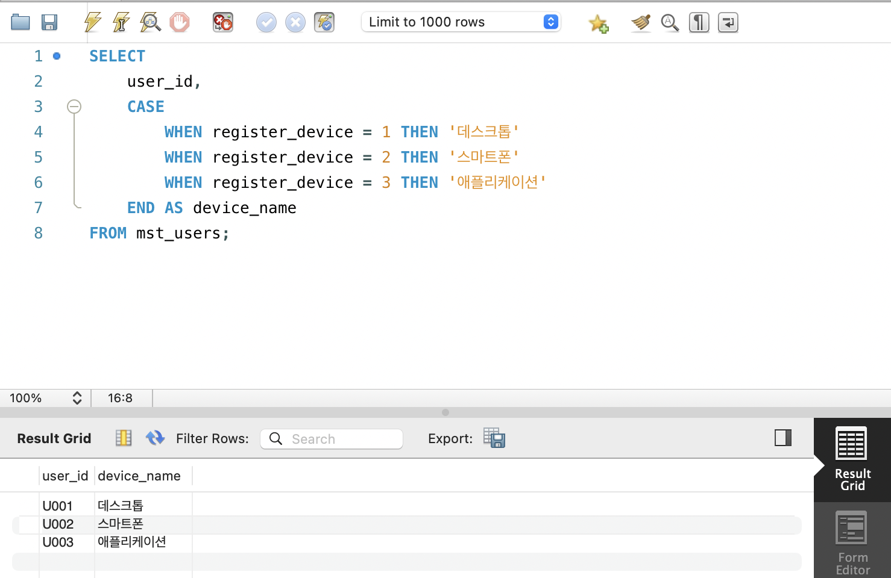

- CASE 문은 
    - 코드 값 -> 의미 있는 변환
    - 조건에 따른 값 생성
    - 데이터 변환
- 에서 많이 사용됨


### 1-2 URL에서 요소 추출하기

- 웹 로그 분석에서는 URL에서 필요한 정보를 추출해야 함
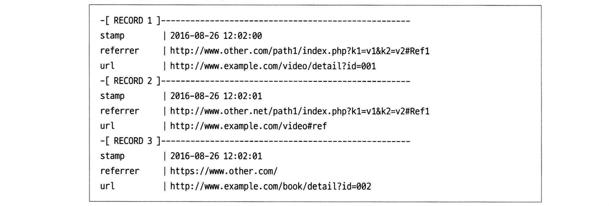

#### 레퍼러로 어떤 웹 페이지를 거쳐 넘어왔는지 판별하기
- 어떤 웹 페이지를 거쳐 넘어왔는지 판별할 때 `레퍼러`를 집계
- 하지만 사진처럼 집계하면 밀도가 너무 작아 복잡해지므로 호스트 단위로 집계하는 것이 일반적
- 기본 구조
```sql
SELECT
    stamp,
    substring(referrer from 'https?://([^/]*)') AS referrer_host
FROM access_log;
```
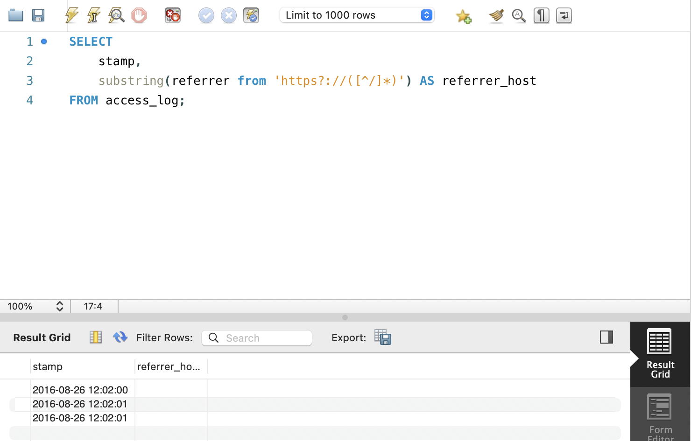
- DB별 URL 함수

| DB | URL 처리 함수 |
|---|---|
| PostgreSQL | substring + 정규표현식 |
| Redshift | regexp_substr |
| Hive / Spark | parse_url |
| BigQuery | host |


#### URL에서 경로와 요청 매개변수 값 추출하기
- URL을 로그 데이터로 저장해두었다면 URL 경로를 가공해서 상품 리포트 생성 가능
- 기본 구조
```sql
SELECT
    stamp,
    url,
    substring(url from '//[^/]+([^?#]+)') AS path,
    substring(url from 'id=([^&]*)') AS id
FROM access_log;
```

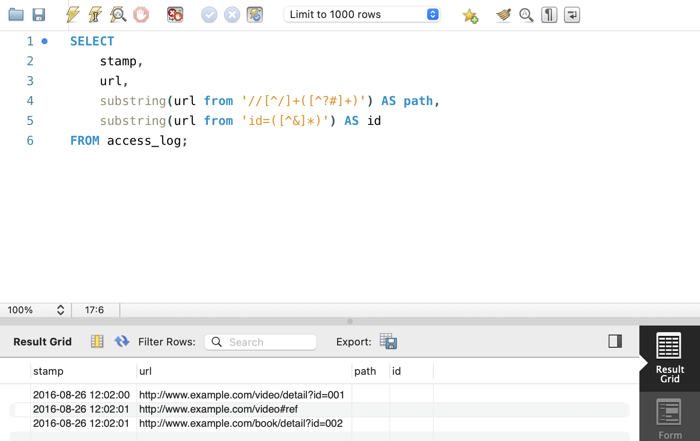


### 1-3 문자열을 배열로 분해하기
- 문자열 자료형은 범용적인 자료형이므로 더 세부적으로 분해해서 사용해야 하는 경우가 많음
- 예
    - 문장 -> 단어
    - csv -> 개별 값
    - URL -> 경로

```sql
SELECT
  stamp,
  url,
  split_part(substring(url from '//[^/]+([^?#]+)'), '/', 2) AS path1,
  split_part(substring(url from '//[^/]+([^?#]+)'), '/', 3) AS path2
FROM access_log;
```
- 문자열을 구분자(delimiter) 기준으로 분리
- spilt/spilt_part 함수 사용 
- URl 분석에서 매우 자주 사용됨 


- Redshift는 공식적으로 배열 자료형의 데이터를 지원하지 않지만, split_part 함수를 사용하여 문자열을 분할한 뒤 n번째 요소 추출 가능

### 1-4 날짜와 타임스탬프 다루기

#### 현재 날짜와 타임스탬프 추출하기
- 로그 데이터 분석에서는 날짜와 시간 정보가 매우 중요하지만 DB마다 자료형, 함수, 타임존 처리가 다름
- 기본 구조
```sql
SELECT
-- PostgreSQL, Hive, BigQuery의 경우
CURRENT.DATE AS dt,
CURRENT_TIMESTAMP AS stamp
-- Hive, BigQuery, SparkSQL의 경우
CURRENT_DATE（） AS dt,
CURRENT_TIMESTAMP（） AS stamp
-- Redshift의 경우 현재 날짜는 CURRENT_DATE, 현재 타임 스탬프는 GETDATEO 사용하기
CURRENT_DATE AS dt,
GETDATEO AS stamp
-- PostgreSQL의 경우 CURRENT_TIMESTAMP는 타임존이 적용된 타임스탬프
-- 타임존을 적용하고 싶지 않으면 LOCALTIMESTAMP 사용하기
LOCALTIMESTAMP AS stamp
``` 
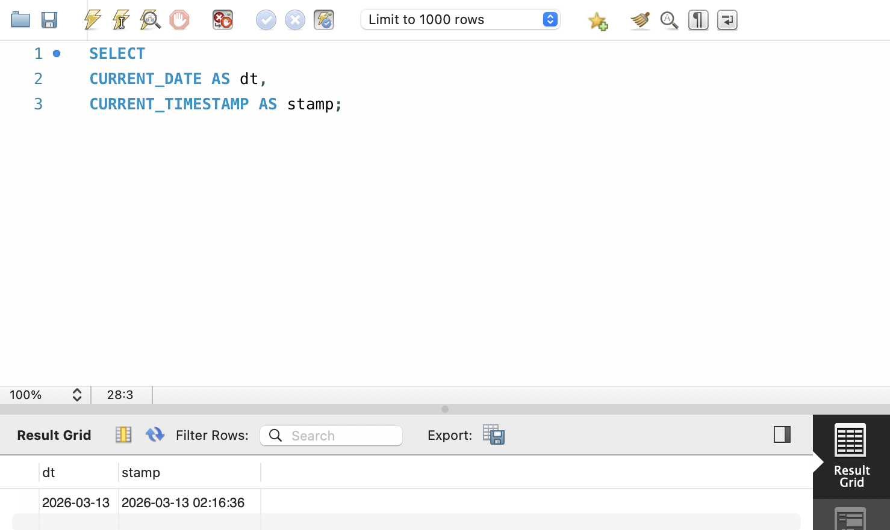

#### 문자열을 날짜/시간 데이터로 변환 
##### CAST 사용
- 기본 구조
```sql
SELECT
  CAST('2016-01-30' AS date) AS dt,
  CAST('2016-01-30 12:00:00' AS timestamp) AS stamp;

-- type(value)
date('2016-01-30')
timestamp('2016-01-30 12:00:00')

-- type value
date '2016-01-30'
timestamp '2016-01-30 12:00:00'
```

#### 날짜에서 특정 필드 추출
- 타임스탬프에서 연도, 월, 일, 시간 추출 가능

#### EXTRACT 함수
```sql 
SELECT
  EXTRACT(YEAR FROM stamp) AS year,
  EXTRACT(MONTH FROM stamp) AS month,
  EXTRACT(DAY FROM stamp) AS day,
  EXTRACT(HOUR FROM stamp) AS hour
FROM table;
```

#### 문자열에서 날짜 추출(substring)
- 날짜를 문자열로 다룰 경우
```sql
SELECT
  substring(stamp,1,4) AS year,
  substring(stamp,6,2) AS month,
  substring(stamp,9,2) AS day,
  substring(stamp,12,2) AS hour
FROM table;
```
- 연월 생성
```sql 
substring(stamp,1,7) AS year_month
``` 


### 1-5 결손 값을 디폴트 값으로 대치하기

- 데이터를 처리할 때 NULL 값이 포함된 경우를 주의해야 함
    - NULL이 포함된 연산의 결과는 대부분 NULL 
- 따라서 분석 전에 NULL을 적절한 값으로 변환하는 과정 필요 

```sql
SELECT
  purchase_id,
  amount,
  coupon,
  amount - coupon AS discount_amount1,
  amount - COALESCE(coupon, 0) AS discount_amount2
FROM purchase_log_with_coupon;
```

#### COALESCE
- NULL 값을 지정한 기본값으로 대체
- `COALESCE(컬럼, 대체값)`


## 2. 여러 개의 값에 대한 조작 

- 데이터 분석에서는 여러 값을 조합하여 새로운 지표를 만들거나 여러 값을 비교하는 경우가 많음
    - *페이지뷰(page view): 페이지가 조회된 횟수*
    - *방문자 수(visitors): 페이지를 방문한 사용자 수*
- 이를 기반으로 새로운 지표를 만들 수 있음
     - *ex) CTR(클릭 비율), CVR(전환 비율) 등*

### 2-1 문자열을 연결하기

- 여러 컬럼의 문자열을 하나로 합칠 때 사용
- 사용 함수
    - `CONCAT()`
    - `||` 연산자 


```sql
-- 1)
SELECT
  user_id,
  CONCAT(pref_name, city_name) AS pref_city
FROM mst_user_location;

--2)
SELECT
  user_id,
  pref_name || city_name AS pref_city
FROM mst_user_location;
```

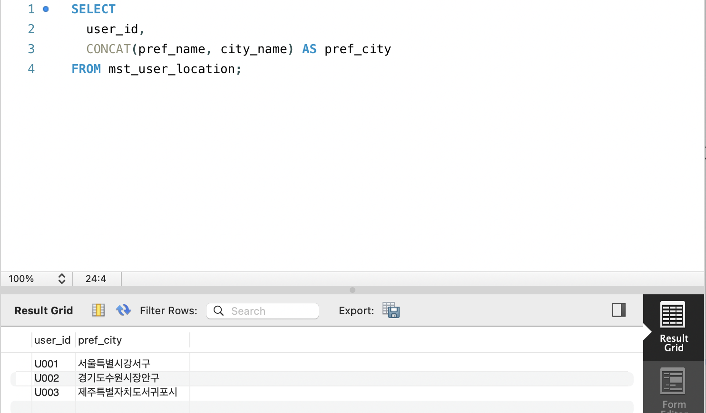


### 2-2 여러 개의 값을 비교하기

- 한 레코드 안의 여러 컬럼 값을 비교할 때 사용 
- 주요 함수

| 함수 | 역할 |
|---|---|
| CASE | 조건 판단 |
| SIGN | 값의 부호 판단 |
| greatest | 최대값 |
| least | 최소값 |

#### 분기 매출 증가 판단
```sql
SELECT
  year,
  q1,
  q2,
  -- Q1과 Q2 매출 변화 판단
  CASE
    WHEN q1 < q2 THEN '+'
    WHEN q1 = q2 THEN ' '
    ELSE '-'
  END AS judge_q1_q2,
  -- Q1과 Q2 매출 차이
  q2 - q1 AS diff_q2_q1,
  -- 매출 증가/감소를 숫자로 표현
  SIGN(q2 - q1) AS sign_q2_q1

FROM quarterly_sales
ORDER BY year;s
```

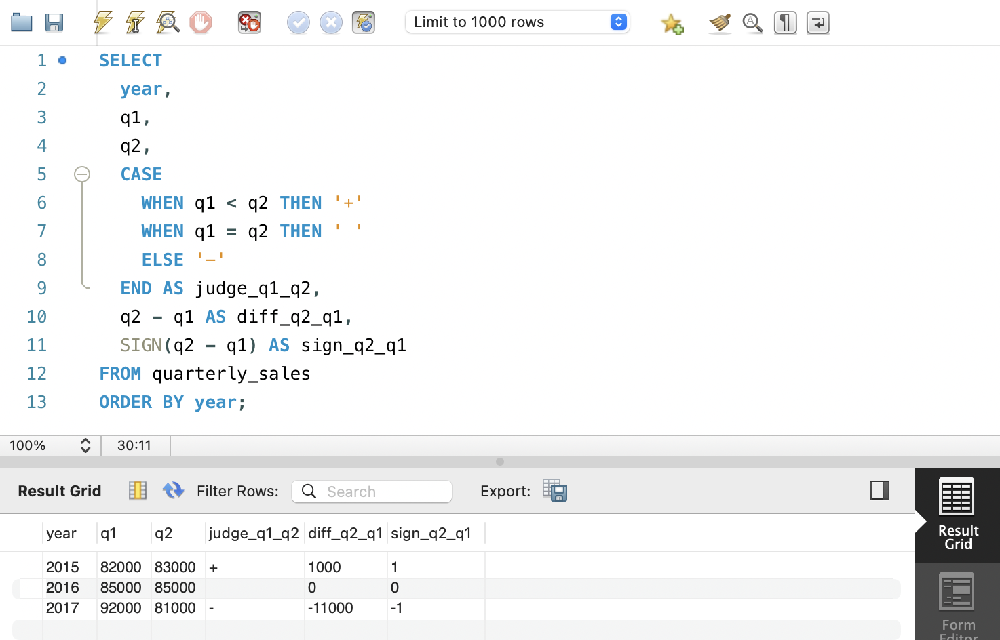

#### 연간 최대/최소 매출 찾기 
```sql
SELECT
  year,
  greatest(q1, q2, q3, q4) AS greatest_sales,
  least(q1, q2, q3, q4) AS least_sales
FROM quarterly_sales
ORDER BY year;
``` 

#### 연간 평균 4분기 매출 계산
```sql
SELECT
  year,
  (q1 + q2 + q3 + q4) / 4 AS average
FROM quarterly_sales
ORDER BY year;
``` 

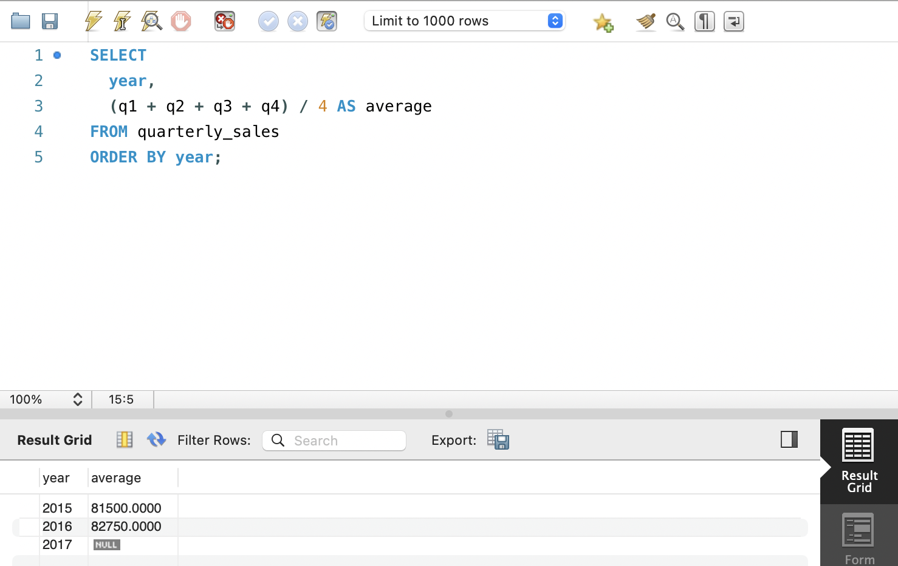

### 2-3 2개의 값 비율 계산하기

- 한 레코드에 포함된 두 값을 조합해 비율을 계산할 수 있음
- 대표적인 예가 광고 데이터의 CTR
    - CTR = 클릭 수 / 노출 수

#### 정수 자료형 데이터 나누기
```sql
SELECT
  dt,
  ad_id,
  clicks / impressions AS ctr,
  100.0 * clicks / impressions AS ctr_as_percent
FROM advertising_stats
WHERE dt = '2017-04-01'
ORDER BY dt, ad_id;
```
#### 0으로 나누는 것 피하기
- 분모가 0인지 머리 처리해야 함
    - `CASE` 사용 
    - `NULLIF` 사용

1. CASE로 처리
```sql
SELECT
  dt,
  ad_id,
  CASE
    WHEN impressions > 0 THEN 100.0 * clicks / impressions
  END AS ctr_as_percent_by_case
FROM advertising_stats
ORDER BY dt, ad_id;
```
- 0보다 클 때만 CTR 계산하고 그 외는 NULL 반환

2. NULLIF로 처리
```sql 
SELECT
  dt,
  ad_id,
  100.0 * clicks / NULLIF(impressions, 0) AS ctr_as_percent_by_null
FROM advertising_stats
ORDER BY dt, ad_id;
``` 
- O이면 NULL, 아니면 원래 값 반환

### 2-4 두 값의 거리 계산하기

- 데이터 분석에서는 두 값이 얼마나 차이가 나는지(거리) 계산하는 경우가 많음 
    - *평균과 특정 값 차이*
    - *작년 매출과 올해 매출 차이*
    - *사용자 행동 유사도 계산*
- 이러한 계산은 추천 시스템이나 데이터 분석에서 자주 사용됨 

#### 숫자 데이터 절댓값과 RMS 계산
```sql
SELECT
  ABS(x1 - x2) AS abs,
  SQRT(POWER(x1 - x2, 2)) AS rms
FROM location_1d;
```
- 사용 함수
    - `ABS()`: 절댓값
    - `POWER()`: 제곱
    - `SQRT()`: 제곱근 

#### 2차원 좌표의 유클리드 거리 계산
- 두 점 (x1, y1) 과 (x2, y2)
- 거리 공식
```
distance = √((x1-x2)² + (y1-y2)²)
``` 
```sql 
SELECT
  SQRT(
      POWER(x1 - x2, 2)
    + POWER(y1 - y2, 2)
  ) AS dist
FROM location_2d;
``` 


### 2-5 날짜/시간을 계산하기

- 날짜 데이터를 이용하면 다음과 같은 분석이 가능 
    - 회원 가입 후 경과 시간
    - 사용자 나이 계산
    - 날짜 간 차이 계산 

#### 날짜/시간 연산 
```sql
SELECT
  user_id,
  register_stamp,
  register_stamp + INTERVAL 1 HOUR AS after_1_hour,
  register_stamp - INTERVAL 30 MINUTE AS before_30_minutes,
  DATE(register_stamp) AS register_date,
  DATE(register_stamp) + INTERVAL 1 DAY AS after_1_day,
  DATE(register_stamp) - INTERVAL 1 MONTH AS before_1_month
FROM mst_users_with_dates;
```
#### 날짜 차이 계산
```sql
SELECT
  user_id,
  CURRENT_DATE AS today,
  DATE(register_stamp) AS register_date,
  DATEDIFF(CURRENT_DATE, DATE(register_stamp)) AS diff_days
FROM mst_users_with_dates;
``` 

#### 문자열 기반 날짜 계산 
```sql
SELECT
  user_id,
  SUBSTRING(register_stamp,1,10) AS register_date,
  birth_date,

  FLOOR(
    (CAST(REPLACE(SUBSTRING(register_stamp,1,10),'-','') AS UNSIGNED)
    - CAST(REPLACE(birth_date,'-','') AS UNSIGNED)
    ) / 10000
  ) AS register_age
FROM mst_users_with_dates;
``` 

### 2-6 IP 주소 다루기

- 웹 로그 데이터에는 보통 사용자의 IP 주소가 저자아됨
- IP 주소는 일반적으로 문자열 형태로 저장되지만, 비교나 정렬을 할 때는 다른 방식으로 처리 필요
- IP 주소 처리 방법
    - IP 전용 자료형 사용
    - IP를 정수로 변환
    - 문자열로 변환 후 비교

#### IP 전용 자료형 사용
```sql
SELECT
  CAST('127.0.0.1' AS inet) < CAST('127.0.0.2' AS inet) AS lt,
  CAST('127.0.0.1' AS inet) > CAST('192.168.0.1' AS inet) AS gt;
```
- 또한 특정 ip가 네트워크 범위에 포함되는지도 확인 가능 
```sql
SELECT
CAST('127.0.0.1' AS inet) << CAST('127.0.0.0/8' AS inet) AS is_contained;
``` 

#### IP 주소 분리하기 
- ip 주소는 4개의 10진수 숫자로 구성
- *ex) 192.168.0.1 -> 192 / 168 / 0 / 1로 구분*

```sql 
SELECT
  ip,
  CAST(SUBSTRING_INDEX(ip,'.',1) AS UNSIGNED) AS ip_part_1,
  CAST(SUBSTRING_INDEX(SUBSTRING_INDEX(ip,'.',2),'.',-1) AS UNSIGNED) AS ip_part_2,
  CAST(SUBSTRING_INDEX(SUBSTRING_INDEX(ip,'.',3),'.',-1) AS UNSIGNED) AS ip_part_3,
  CAST(SUBSTRING_INDEX(ip,'.',-1) AS UNSIGNED) AS ip_part_4
FROM ip_table;
``` 

#### IP를 정수로 변환하기
- IP는 다음 방식으로 정수로 변환 가능 
```
ip = part1 * 2^24
    + part2 * 2^16
    + part3 * 2^8
    + part4
```

```sql
SELECT
  ip,
  (CAST(SUBSTRING_INDEX(ip,'.',1) AS UNSIGNED) * POW(2,24) +
   CAST(SUBSTRING_INDEX(SUBSTRING_INDEX(ip,'.',2),'.',-1) AS UNSIGNED) * POW(2,16) +
   CAST(SUBSTRING_INDEX(SUBSTRING_INDEX(ip,'.',3),'.',-1) AS UNSIGNED) * POW(2,8) +
   CAST(SUBSTRING_INDEX(ip,'.',-1) AS UNSIGNED)
  ) AS ip_integer
FROM ip_table;
``` 

#### IP 주소를 문자열로 정렬하기
- 문자열 상태에서 IP를 정렬하려면 각 부분을 3자리 숫자로 맞춰야 함
- *ex) 192.168.0.1 -> 192168000001*

```sql
SELECT
  ip,
  CONCAT(
    LPAD(SUBSTRING_INDEX(ip,'.',1),3,'0'),
    LPAD(SUBSTRING_INDEX(SUBSTRING_INDEX(ip,'.',2),'.',-1),3,'0'),
    LPAD(SUBSTRING_INDEX(SUBSTRING_INDEX(ip,'.',3),'.',-1),3,'0'),
    LPAD(SUBSTRING_INDEX(ip,'.',-1),3,'0')
  ) AS ip_padding
FROM ip_table;
```

## 03. 하나의 테이블에 대한 조작 
- SQL의 특징은 데이터를 집합(set) 단위로 처리하는 것
- 이전 장에서는 개별 레코드 처리를 다뤘다면, 이번 장에서는
    - 데이터 집약(Aggregation)
    - 데이터 가공
    - 윈도우 함수
- 를 이용해 테이블 전체를 분석하는 방법을 다룸

### 3-1 그룹의 특징 잡기

<!-- 이 부분을 지우고 새롭게 배운 내용을 자유롭게 정리해주세요. -->

#### 테이블 전체 특징 계산 
```sql
SELECT
 COUNT(*) AS total_count,
 COUNT(DISTINCT user_id) AS user_count,
 COUNT(DISTINCT product_id) AS product_count,
 SUM(score) AS sum,
 AVG(score) AS avg,
 MAX(score) AS max,
 MIN(score) AS min
FROM review;
```
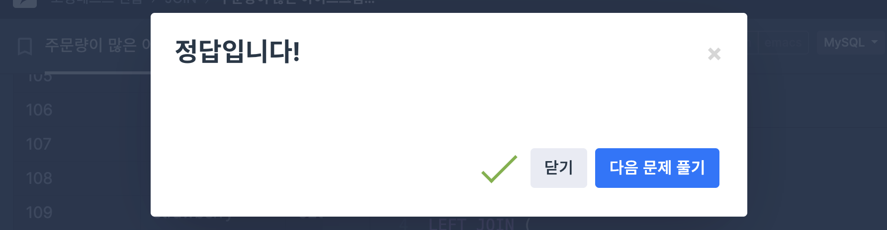

#### 그룹별 특징 계산(GROUP BY)
**`GROUP BY` 사용시 주의**
- SELECT에는 GROUP BY에 포함된 컬럼과 집약 함수 불가능

```sql
SELECT
 user_id,
 COUNT(*) AS total_count,
 COUNT(DISTINCT product_id) AS product_count,
 SUM(score) AS sum,
 AVG(score) AS avg,
 MAX(score) AS max,
 MIN(score) AS min
FROM review
GROUP BY user_id;
```
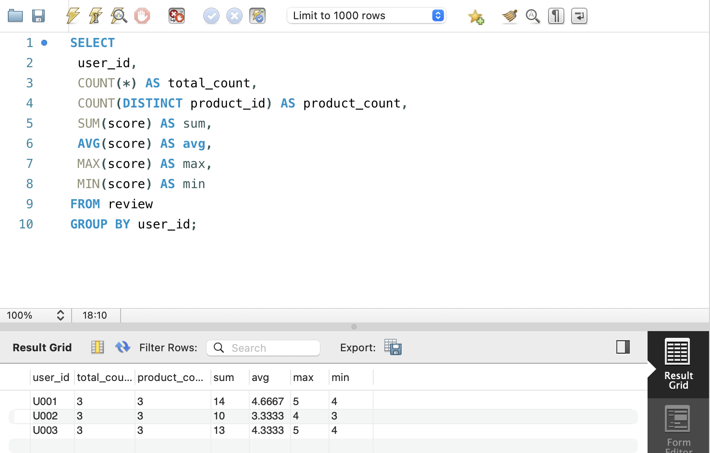

#### 집약값과 원본값 같이 사용(윈도우 함수)
- 윈도우 함수는 집약 결과 + 원본 데이터를 동시에 보여줄 수 있음 
```sql
SELECT
 user_id,
 product_id,
 score,
 AVG(score) OVER() AS avg_score,
 AVG(score) OVER(PARTITION BY user_id) AS user_avg_score,
 score - AVG(score) OVER(PARTITION BY user_id) AS user_avg_score_diff
FROM review;
```
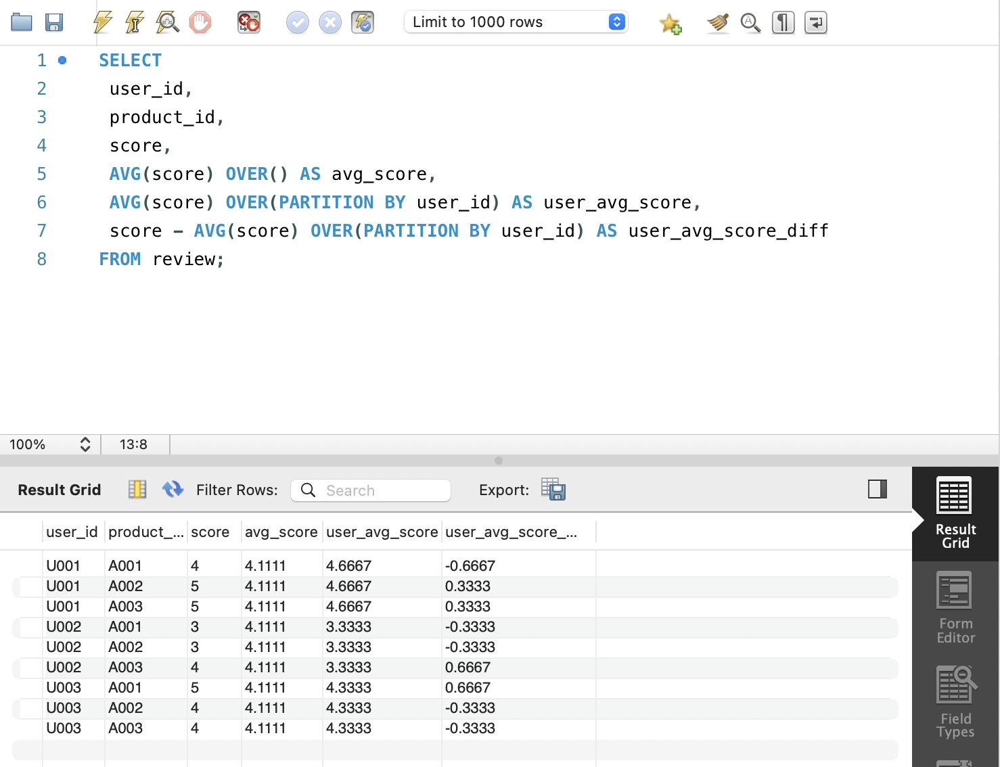

### 3-2 그룹 내부의 순서

#### 그룹 내부 순서
    - ROW_NUMBER: 고유 순위
    - RANK: 공동순위 가능
    - DENSE_RANK: 공동순위 다음 순위 건너뛰지 않음 *ex) 1223..*
<!-- 이 부분을 지우고 실행 결과 화면을 제출해주세요. -->
```sql
SELECT
 product_id,
 score,
 ROW_NUMBER() OVER(ORDER BY score DESC) AS row,
 RANK() OVER(ORDER BY score DESC) AS rank,
 DENSE_RANK() OVER(ORDER BY score DESC) AS dense_rank
FROM popular_products;
``` 

#### 순위 계산
```sql
SELECT
 product_id,
 score,
 ROW_NUMBER() OVER(ORDER BY score DESC) AS row,
 RANK() OVER(ORDER BY score DESC) AS rank,
 DENSE_RANK() OVER(ORDER BY score DESC) AS dense_rank
FROM popular_products;
```
#### 이전/다음 값 확인 
- 윈도우 함수로 이전 행/다음 행 데이터 조회 가능 
    - `LAG()`: 이전 행
    - `LEAD()`: 다음 행
```sql 
SELECT
 product_id,
 score,
 LAG(product_id) OVER(ORDER BY score DESC) AS prev_product,
 LEAD(product_id) OVER(ORDER BY score DESC) AS next_product
FROM popular_products;
```

#### 누적 계산
- 윈도우 함수로 누적 합/이동 평균 가능 
1. 누적 합 
```sql
SELECT
 product_id,
 score,
 SUM(score) OVER(
   ORDER BY score DESC
   ROWS BETWEEN UNBOUNDED PRECEDING AND CURRENT ROW
 ) AS cum_score
FROM popular_products;
```

2. 이동 평균
```sql
SELECT
 product_id,
 score,
 AVG(score) OVER(
   ORDER BY score DESC
   ROWS BETWEEN 1 PRECEDING AND 1 FOLLOWING
 ) AS local_avg
FROM popular_products;
``` 

#### 그룹별 순위
```sql
SELECT
 category,
 product_id,
 score,
 ROW_NUMBER() OVER(
  PARTITION BY category
  ORDER BY score DESC
 ) AS row
FROM popular_products;
```

#### 카테고리별 상위 N개
```sql
SELECT *
FROM (
 SELECT
   category,
   product_id,
   score,
   ROW_NUMBER() OVER(
     PARTITION BY category
     ORDER BY score DESC
   ) AS rank
 FROM popular_products
) t
WHERE rank <= 2;
``` 

### 3-3 세로 기반 데이터를 가로 기반으로 변환하기

- SQL은 기본적으로 행(row) 중심 데이터 구조
- 하지만 분석이나 리포트에서는 열(column) 형태로 보는 것이 더 직관적일 때가 많음
- 따라서 세로 -> 가로 데이터 변환(pivot)이 필요

```sql
SELECT
 dt,
 MAX(CASE WHEN indicator = 'impressions' THEN val END) AS impressions,
 MAX(CASE WHEN indicator = 'sessions' THEN val END) AS sessions,
 MAX(CASE WHEN indicator = 'users' THEN val END) AS users
FROM daily_kpi
GROUP BY dt
ORDER BY dt;
```
- SQL에서는 보통 `MAX`+`CASE` 조합 사용
    - CASE: 조건별 값 추출
    - MAX: 각 그룹에서 하나의 값만 남기기 위해 사용


### 3-4 가로 기반 데이터를 세로 기반으로 변환하기


```sql
SELECT
 q.year,
 CASE
   WHEN p.idx = 1 THEN 'q1'
   WHEN p.idx = 2 THEN 'q2'
   WHEN p.idx = 3 THEN 'q3'
   WHEN p.idx = 4 THEN 'q4'
 END AS quarter,
 CASE
   WHEN p.idx = 1 THEN q.q1
   WHEN p.idx = 2 THEN q.q2
   WHEN p.idx = 3 THEN q.q3
   WHEN p.idx = 4 THEN q.q4
 END AS sales
FROM quarterly_sales q
CROSS JOIN
(
 SELECT 1 AS idx
 UNION ALL SELECT 2
 UNION ALL SELECT 3
 UNION ALL SELECT 4
) p;
```


## 04. 여러 개의 테이블 조작하기
- 데이터 분석에서는 여러 테이블을 결합하여 분석하는 경우가 많음
1. 업무 데이터(RDB 구조)
- 정규화된 여러 테이블 존재
- 필요한 정보를 얻기 위해 JOIN 사용
2. 로그 데이터
- 하나의 로그 테이블에서도 여러 이벤트를 비교하거나 여러 로그 테이블을 함께 분석해야 하는 경우 발생

### 4-1 여러 개의 테이블을 세로로 결합하기
- 여러 테이블의 구조가 동일할 때 행을 이어붙이는 방법 

#### UNION ALL
```sql
SELECT 'app1' AS app_name, user_id, name, email
FROM app1_mst_users

UNION ALL

SELECT 'app2' AS app_name, user_id, name, NULL AS email
FROM app2_mst_users;
```
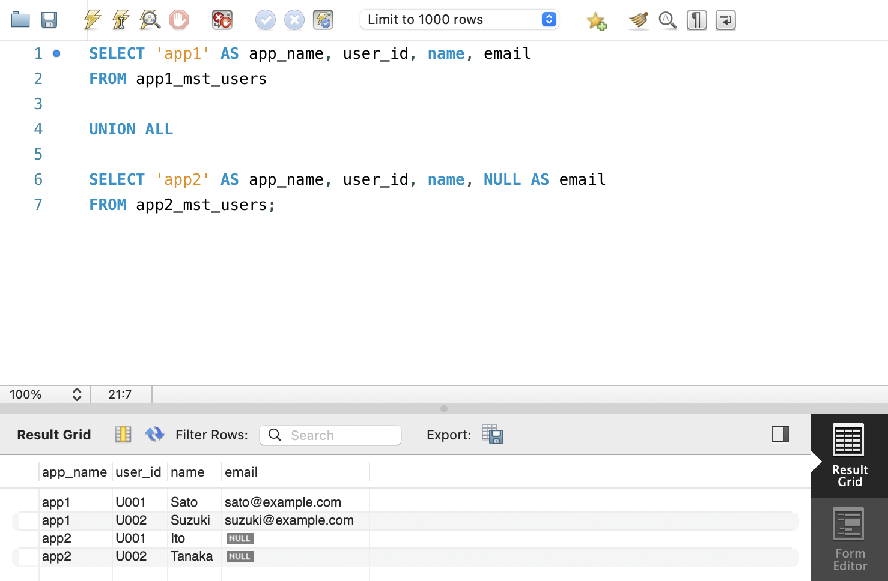


### 4-2 여러 개의 테이블을 가로로 정렬하기
- 여러 테이블의 정보를 열 기준으로 결합 

#### JOIN
```sql
SELECT
    m.category_id,
    m.name,
    s.sales,
    r.product_id AS sale_product
FROM mst_categories AS m
JOIN category_sales AS s
    ON m.category_id = s.category_id
JOIN product_sale_ranking AS r
    ON m.category_id = r.category_id;
```
#### LEFT JOIN을 사용하는 이유
- INNER JOIN을 사용하면 결합되지 않는 데이터가 사라질 수 있음
```sql
SELECT
    m.category_id,
    m.name,
    s.sales,
    r.product_id AS top_sale_product
FROM mst_categories m

LEFT JOIN category_sales s
ON m.category_id = s.category_id

LEFT JOIN product_sale_ranking r
ON m.category_id = r.category_id
AND r.rank = 1;
```

### 4-3 조건 플래그를 0과 1로 표현하기

- 데이터 분석에서 매우 자주 사용
    - `CASE`와 `SIGN` 사용
```sql
SELECT
    m.user_id,
    m.card_number,

    COUNT(p.user_id) AS purchase_count,

    CASE
        WHEN m.card_number IS NOT NULL THEN 1
        ELSE 0
    END AS has_card,

    SIGN(COUNT(p.user_id)) AS has_purchased

FROM mst_users_with_card_number m

LEFT JOIN purchase_log p
ON m.user_id = p.user_id

GROUP BY m.user_id, m.card_number;
```
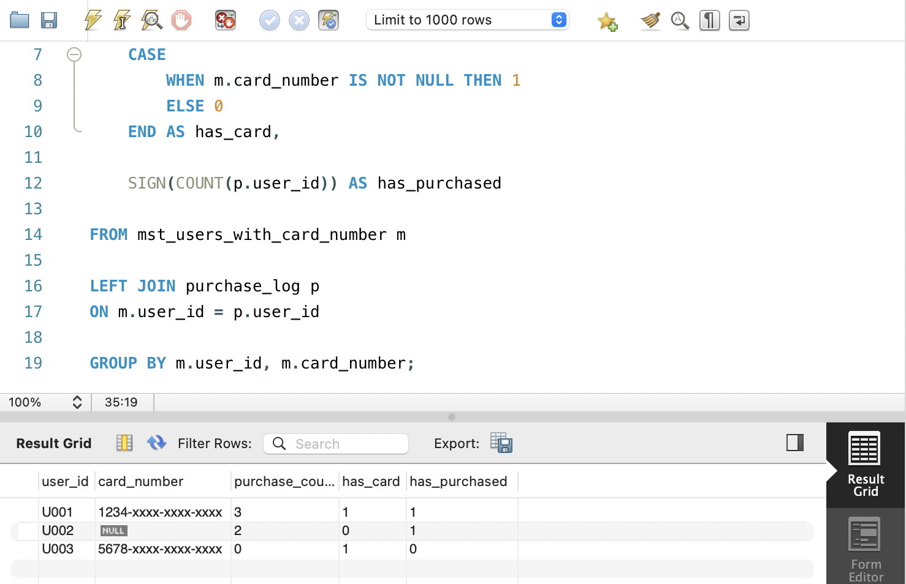

### 4-4 계산한 테이블에 이름 붙여 재사용하기
- 복잡한 SQL에서는 중간 계산 테이블을 만들면 가독성이 좋아짐 

#### CTE (WITH)
```sql
WITH product_sale_ranking AS (

SELECT
    category_name,
    product_id,
    sales,

    ROW_NUMBER() OVER(
        PARTITION BY category_name
        ORDER BY sales DESC
    ) AS rank

FROM product_sales

)

SELECT *
FROM product_sale_ranking;
```

### 4-5 유사 테이블 만들기
- 실제 테이블이 없을 때 임시 테이블을 만드는 방법 

#### UNION ALL
```sql
WITH mst_devices AS (

SELECT 1 AS device_id, 'PC' AS device_name
UNION ALL
SELECT 2, 'SP'
UNION ALL
SELECT 3, '애플리케이션'

)

SELECT *
FROM mst_devices;
```

#### 순번을 사용해 테이블 작성 

```sql
WITH RECURSIVE series AS (
SELECT 1 AS idx
UNION ALL
SELECT idx + 1
FROM series
WHERE idx < 5
)

SELECT *
FROM series;
```


### 🎉 수고하셨습니다.