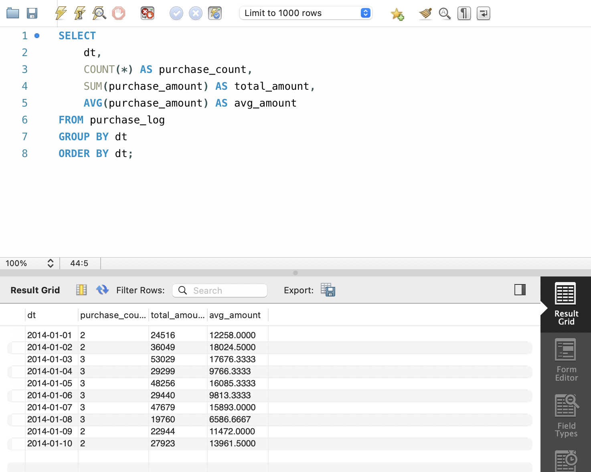

# SQL_MASTER 3주차 정규과제

📌SQL MASTER 정규과제는 매주 정해진 분량의 『*데이터 분석을 위한 SQL 레시피*』 를 읽고 학습하는 것입니다. 이번 주는 아래의 **SQL_MASTER_3rd_TIL**에 나열된 분량을 읽고 공부하시면 됩니다.

아래 실습을 수행하며 학습 내용을 직접 적용해보세요. 단순히 결과를 재현하는 것이 아니라, SQL을 직접 작성하는 과정에서 개념을 스스로 정리하는 것이 중요합니다.

필요한 경우 교재와 추가 자료를 참고하여 이해를 보완하시기 바랍니다.

## SQL_MASTER_3rd_TIL

### 4장 매출을 파악하기 위한 데이터 추출
#### 1. 시계열 기반으로 데이터 집계하기
#### 2. 다면적인 축을 사용해 데이터 집계하기 


## Study Schedule

| 주차  | 공부 범위     | 완료 여부 |
| ----- | ------------- | --------- |
| 1주차 | p.20~50    | ✅         |
| 2주차 | p.52~136   | ✅         |
| 3주차 | p.138~184  | ✅         |
| 4주차 | p.186~232 | 🍽️         |
| 5주차 | p.233~321 | 🍽️         |
| 6주차 | p.324~406 | 🍽️         |
| 7주차 | p.408~464 | 🍽️         |

<br>

<!-- 여기까진 그대로 둬 주세요-->

# 실습

## 0. 실습 규칙

1. 샘플 데이터 생성 코드는 **07_SQL_MASTER_Template/src** 경로에 장별로 정리되어 있습니다.
2. 아래 목차에 맞춰 해당 코드를 실행하여 샘플 데이터를 생성한 후, 각 장에서 요구하는 쿼리를 직접 작성해보시기 바랍니다.
3. 작성한 쿼리의 **실행 결과 화면도 함께 제출**해 주세요.
4. 단순히 교재의 예시 코드를 그대로 작성하는 것이 아니라, **제시된 로직을 충분히 이해한 뒤 교재를 보지 않고 스스로 쿼리를 구성**해보는 것을 권장합니다.
5. 교재 예시는 PostgreSQL, Hive, BigQuery 등 다양한 DBMS 기준으로 제시되어 있기 때문에, **MySQL이 아닌 다른 SQL 환경을 사용하여 실습을 진행해도 무방합니다.**
6. 다만, 사용 중인 DBMS에 맞는 문법으로 적절히 변환하여 작성하시기 바랍니다.


## 1. 시계열 기반으로 데이터 집계하기

- 실무 데이터 분석에서는
    - 매출
    - 사용자 수
    - 페이지 뷰
- 와 같은 지표를 시계열 기준으로 집계하는 작업이 매우 중요 

```
단순 수치 확인이 아니라
추세(trend), 변화 폭 비교, 패턴 발견
을 위해 필수적인 분석 방법
```

### 1-1 날짜별 매출 집계하기

- 핵심 개념
    - `GROUP BY`: 날짜 단위 집계
    - `SUM`: 총 매출
    - `AVG`: 평균 구매 금액
    - `COUNT`: 구매 건수

```sql
SELECT
    dt,
    COUNT(*) AS purchase_count,        -- 구매 건수
    SUM(purchase_amount) AS total_amount,  -- 총 매출
    AVG(purchase_amount) AS avg_amount     -- 평균 구매 금액
FROM purchase_log
GROUP BY dt
ORDER BY dt;
```
- 해석
    - purchase_count: 트래픽/활성도
    - total_amount: 매출 규모
    - avg_amount: 객단가


 
### 1-2 이동평균을 사용한 날짜별 추이 보기

#### 이동평균
- 일별 데이터는 변동성이 커서 추세 파악이 어려움
    - **이동 평균 사용**
- 개념
    - 최근 N일 평균을 계산
    - 노이즈 제거 + 트렌드 확인

```sql
SELECT
    dt,
    SUM(purchase_amount) AS total_amount,

    -- 7일 이동평균
    AVG(SUM(purchase_amount)) 
    OVER (
        ORDER BY dt 
        ROWS BETWEEN 6 PRECEDING AND CURRENT ROW
    ) AS seven_day_avg,

    -- 7일 데이터가 모두 있을 때만 계산
    CASE 
        WHEN COUNT(*) 
        OVER (
            ORDER BY dt 
            ROWS BETWEEN 6 PRECEDING AND CURRENT ROW
        ) = 7
        THEN AVG(SUM(purchase_amount))
        OVER (
            ORDER BY dt 
            ROWS BETWEEN 6 PRECEDING AND CURRENT ROW
        )
    END AS seven_day_avg_strict

FROM purchase_log
GROUP BY dt
ORDER BY dt;
```

 
### 1-3 당월 매출 누계 구하기

- 일별 매출만 보면 이번 달 목표 대비 얼마나 나왔는지 알 수 없음
    - 그래서 **누적 매출**을 사용
- 개념
    - `OVER + ORDER BY`: 누적 계산
    - `PARTITION BY`: 월 단위로 끊어서 계산 

```sql
SELECT
    dt,

    -- 연-월 추출
    substring(dt, 1, 7) AS year_month,

    -- 일별 매출
    SUM(purchase_amount) AS total_amount,

    -- 월별 누적 매출
    SUM(SUM(purchase_amount)) 
    OVER (
        PARTITION BY substring(dt, 1, 7)
        ORDER BY dt
        ROWS UNBOUNDED PRECEDING
    ) AS agg_amount

FROM purchase_log
GROUP BY dt
ORDER BY dt;
```


### 1-4 월별 매출의 작대비 구하기

#### 작대비
- 전년 대비 성장률 확인
    - 매출이 증가한 건지 or 감소한 건지 판단
- 개념
    - `CASE WITH`: 연도별 분리
    - `SUM`:  월별 집계
    - 비율 계산


```sql
WITH daily_purchase AS (
    SELECT
        substring(dt, 1, 4) AS year,
        substring(dt, 6, 2) AS month,
        SUM(purchase_amount) AS purchase_amount
    FROM purchase_log
    GROUP BY dt
)

SELECT
    month,

    -- 2014년 매출
    SUM(CASE WHEN year = '2014' THEN purchase_amount END) AS amount_2014,

    -- 2015년 매출
    SUM(CASE WHEN year = '2015' THEN purchase_amount END) AS amount_2015,

    -- 작대비 (YoY)
    100.0 *
    SUM(CASE WHEN year = '2015' THEN purchase_amount END)
    /
    SUM(CASE WHEN year = '2014' THEN purchase_amount END)
    AS rate

FROM daily_purchase
GROUP BY month
ORDER BY month;
```

 
### 1-5 Z 차트로 업적의 추이 확인하기

#### Z 차트
- 개념
    - 월매출, 누적 매출, 이동 누계를 한 번에 보는 분석
    - **계절성 제거 + 트랜드 파악** 가능
- 구성 요소
    - 월 매출
    - 누적 매출
    - 이동 누계
- 해석법
    - 누적매출
        - 기울기 증가 -> 성장
        - 기울기 감소 -> 둔화
    - 이동 누계
        - 우상향 -> 지속 성장
        - 우하향 -> 하락 추세 
- 패턴
    - 이상적인 성장
        - 월매출, 누적매출, 이동누계 모두 성장
    - 일시적 성장
        - 월매출, 누적매출 증가, 이동누계 변화 없음
    - 성장 둔화
        - 월매출 유지 또는 감소, 누적매출 완만한 증가, 이동누계 감소 

```sql
# 월별 집계
WITH monthly_amount AS (
    SELECT
        year,
        month,
        SUM(purchase_amount) AS amount
    FROM daily_purchase
    GROUP BY year, month
)

# 누적 + 이동누계
, calc_index AS (
    SELECT
        year,
        month,
        amount,

        -- 누적 매출
        SUM(CASE WHEN year = '2015' THEN amount END)
        OVER (ORDER BY year, month ROWS UNBOUNDED PRECEDING)
        AS agg_amount,

        -- 이동 누계 (12개월)
        SUM(amount)
        OVER (
            ORDER BY year, month
            ROWS BETWEEN 11 PRECEDING AND CURRENT ROW
        ) AS year_avg_amount

    FROM monthly_amount
)

# 최종 출력
SELECT
    CONCAT(year, '-', month) AS year_month,
    amount,
    agg_amount,
    year_avg_amount
FROM calc_index
WHERE year = '2015'
ORDER BY year_month;
```

```sql
WITH monthly_purchase AS (
    SELECT
        year,
        month,
        SUM(orders) AS orders,
        AVG(purchase_amount) AS avg_amount,
        SUM(purchase_amount) AS monthly
    FROM daily_purchase
    GROUP BY year, month
)

SELECT
    CONCAT(year, '-', month) AS year_month,
    orders,
    avg_amount,
    monthly,

    -- 누적 매출
    SUM(monthly)
    OVER (
        PARTITION BY year
        ORDER BY month
        ROWS UNBOUNDED PRECEDING
    ) AS agg_amount,

    -- 작년 매출
    LAG(monthly, 12)
    OVER (ORDER BY year, month) AS last_year,

    -- 작대비
    100.0 * monthly / 
    LAG(monthly, 12)
    OVER (ORDER BY year, month) AS rate

FROM monthly_purchase
ORDER BY year_month;
```
 
### 1-6 매출을 파악할 때 중요 포인트 

- 매출만 보지 말고 매출 구조를 분해해야 함
    - 매출 = 구매 건수 x 평균 구매 금액 
- 케이스 분석
    - 매출 변화 없음
        - 구매 건수 증가, 객단가 감소
    - 매출 증가
        - 구매 건수 감소, 객단가 증가
    - 매출 감소
        - 구매 건수 감소, 객단가 감소

```sql
WITH daily_purchase AS (
    SELECT
        dt,
        substring(dt, 1, 4) AS year,
        substring(dt, 6, 2) AS month,
        SUM(purchase_amount) AS purchase_amount,
        COUNT(order_id) AS orders
    FROM purchase_log
    GROUP BY dt
),

monthly_purchase AS (
    SELECT
        year,
        month,
        SUM(orders) AS orders,
        AVG(purchase_amount) AS avg_amount,
        SUM(purchase_amount) AS monthly
    FROM daily_purchase
    GROUP BY year, month
)

SELECT
    CONCAT(year, '-', month) AS year_month,
    orders,
    avg_amount,
    monthly,

    -- 누적 매출
    SUM(monthly)
    OVER (
        PARTITION BY year
        ORDER BY month
        ROWS UNBOUNDED PRECEDING
    ) AS agg_amount,

    -- 작년 매출
    LAG(monthly, 12)
    OVER (ORDER BY year, month) AS last_year,

    -- 작대비 (YoY)
    100.0 * monthly /
    LAG(monthly, 12)
    OVER (ORDER BY year, month) AS rate

FROM monthly_purchase
ORDER BY year_month;
```


## 2. 다면적인 축을 사용해 데이터 집계하기 

### 2-1 카테고리별 매출과 소계 계산하기

- 방법
    - `UNION ALL`
    - `ROLL UP`


```sql
WITH sub_category_amount AS (
  SELECT category, sub_category, SUM(price) AS amount
  FROM purchase_detail_log
  GROUP BY category, sub_category
),
category_amount AS (
  SELECT category, 'all' AS sub_category, SUM(price) AS amount
  FROM purchase_detail_log
  GROUP BY category
),
total_amount AS (
  SELECT 'all' AS category, 'all' AS sub_category, SUM(price) AS amount
  FROM purchase_detail_log
)

SELECT * FROM sub_category_amount
UNION ALL
SELECT * FROM category_amount
UNION ALL
SELECT * FROM total_amount;
```
```sql
SELECT
  COALESCE(category, 'all') AS category,
  COALESCE(sub_category, 'all') AS sub_category,
  SUM(price) AS amount
FROM purchase_detail_log
GROUP BY ROLLUP(category, sub_category);
``` 


### 2-2 ABC 분석으로 잘 팔리는 상품 판별하기

- 개념 
    - 잘 팔리는 상품 구분

```sql
WITH monthly_sales AS (
  SELECT
    category,
    SUM(price) AS amount
  FROM purchase_detail_log
  WHERE dt BETWEEN '2015-12-01' AND '2015-12-31'
  GROUP BY category
),

sales_ratio AS (
  SELECT
    category,
    amount,

    -- 구성비
    100.0 * amount / SUM(amount) OVER() AS composition_ratio,

    -- 누적 구성비
    100.0 * SUM(amount)
      OVER (ORDER BY amount DESC ROWS UNBOUNDED PRECEDING)
      / SUM(amount) OVER() AS cumulative_ratio

  FROM monthly_sales
)

SELECT *,
  CASE
    WHEN cumulative_ratio <= 70 THEN 'A'
    WHEN cumulative_ratio <= 90 THEN 'B'
    ELSE 'C'
  END AS abc_rank
FROM sales_ratio
ORDER BY amount DESC;
```


### 2-3 팬 차트로 상품의 매출 증가율 확인하기

### 팬 차트
- 개념
    - 기준 시점 = 100%일 때 이후 변화를 비율로 보는 그래프
    - 절대값이 아닌 성장률/감소율 확인

```sql
SELECT
  year_month,
  category,
  amount,

  -- 기준값 (첫 시점)
  FIRST_VALUE(amount)
  OVER (PARTITION BY category ORDER BY year_month) AS base_amount,

  -- 변화율 (%)
  100.0 * amount /
  FIRST_VALUE(amount)
  OVER (PARTITION BY category ORDER BY year_month) AS rate

FROM monthly_category_amount;
```

### 2-4 히스토그램으로 구매 가격대 집계하기 

#### 히스토그램
- 값 분포 확인 


```sql
# 범위 계산
SELECT
  MAX(price) AS max_price,
  MIN(price) AS min_price,
  MAX(price) - MIN(price) AS range_price
FROM purchase_detail_log;

# bucket 생성
FLOOR(
  (price - min_price) / bucket_range
) + 1 AS bucket

# 집계
SELECT
  bucket,
  COUNT(*) AS num_purchase,
  SUM(price) AS total_amount
FROM data
GROUP BY bucket;
```


### 🎉 수고하셨습니다.